# 3. Enterprise-Structure Model

Original design, functionally inspired by S/4HANA enterprise structure. All names
and keys below are ours.

## 3.1 The structure at a glance

```
Tenant (client)
 └── Company .......................... legal group / consolidation unit
      └── CompanyCode ................. smallest unit with a complete self-contained ledger
           ├── local currency (mandatory)
           ├── operational Chart of Accounts (mandatory)
           ├── FiscalYearVariant, PostingPeriodVariant, FieldStatusVariant
           ├── BusinessArea*         (cross-company-code, optional reporting cut)
           ├── Plant ─── Location ─── Branch
           ├── SalesOrganization ─ DistributionChannel ─ Division
           ├── PurchasingOrganization ─ PurchasingGroup
           └── Department
ControllingArea ......... spans 1..N company codes (compatible ones only)
 ├── CostCenter (hierarchy)
 ├── ProfitCenter (hierarchy)   ──► Segment
 ├── InternalOrder
 ├── FunctionalArea
 └── OperatingConcern (1 : N controlling areas)
CreditControlArea ....... spans 1..N company codes
```

`*` BusinessArea and Segment are tenant-level dimensions usable by any company
code — they are *reporting* cuts, not owners of anything.

## 3.2 Entity-relationship model (org schema)

```mermaid
erDiagram
    Tenant ||--o{ Company : contains
    Company ||--o{ CompanyCode : contains
    CompanyCode }o--|| Currency : "local currency"
    CompanyCode }o--|| ChartOfAccounts : "operational CoA"
    CompanyCode }o--|| FiscalYearVariant : uses
    CompanyCode }o--|| PostingPeriodVariant : uses
    CompanyCode }o--|| FieldStatusVariant : uses
    CompanyCode ||--o{ Plant : owns
    CompanyCode ||--o{ Branch : owns
    CompanyCode ||--o{ Department : owns
    Plant ||--o{ Location : has
    CompanyCode ||--o{ SalesOrganization : owns
    SalesOrganization ||--o{ DistributionChannel : has
    SalesOrganization ||--o{ Division : has
    CompanyCode ||--o{ PurchasingOrganization : owns
    PurchasingOrganization ||--o{ PurchasingGroup : has
    ControllingArea ||--o{ ControllingAreaCompanyCode : assigns
    CompanyCode ||--o{ ControllingAreaCompanyCode : "assigned to"
    ControllingArea }o--|| Currency : "CO area currency"
    ControllingArea ||--o{ CostCenter : contains
    ControllingArea ||--o{ ProfitCenter : contains
    ControllingArea ||--o{ InternalOrder : contains
    ControllingArea ||--o{ FunctionalArea : contains
    OperatingConcern ||--o{ ControllingArea : groups
    ProfitCenter }o--o| Segment : derives
    CreditControlArea ||--o{ CompanyCodeCreditControl : assigns
    FiscalYearVariant ||--o{ FiscalPeriod : defines
    ChartOfAccounts ||--o{ GLAccountGroup : defines
    Tenant ||--o{ BusinessArea : defines
    Tenant ||--o{ Segment : defines
    Currency ||--o{ ExchangeRate : "from/to"
    ExchangeRateType ||--o{ ExchangeRate : classifies
    CompanyCode ||--o{ DocumentType : permits
    DocumentType }o--|| NumberRange : uses
    CompanyCode ||--o{ TaxCode : defines
    TaxJurisdiction ||--o{ TaxCode : scopes
```



## 3.3 Core table catalogue (org / cfg)

| Table | Key (business) | Notes |
|---|---|---|
| `org.Tenant` | `TenantCode` | Root of isolation; owns everything below |
| `org.Company` | `TenantId, CompanyCode6` | Consolidation/group unit; group currency defined here |
| `org.CompanyCode` | `TenantId, CompanyCodeKey (4)` | **Ledger-complete unit.** Local currency, CoA, variants, country, address, tax registration |
| `org.BusinessArea` | `TenantId, BusinessAreaKey (4)` | Cross-company reporting dimension |
| `org.Plant` | `TenantId, PlantKey (4)` | Belongs to one company code |
| `org.Branch` | `TenantId, BranchKey (4)` | Belongs to one company code; carries its own tax/registration data where local law requires |
| `org.Location` | `TenantId, PlantId, LocationKey` | Physical sub-division of a plant |
| `org.Department` | `TenantId, CompanyCodeId, DepartmentKey` | Used by workflow routing and cost-center ownership |
| `org.SalesOrganization` | `TenantId, SalesOrgKey (4)` | + `DistributionChannel`, `Division`, and the `SalesArea` combination table |
| `org.PurchasingOrganization` | `TenantId, PurchOrgKey (4)` | + `PurchasingGroup` |
| `org.ControllingArea` | `TenantId, ControllingAreaKey (4)` | CO currency + currency type; fiscal year variant must match assigned company codes |
| `org.ControllingAreaCompanyCode` | `ControllingAreaId, CompanyCodeId` | Validity-dated assignment |
| `org.OperatingConcern` | `TenantId, OperatingConcernKey (4)` | Profitability analysis scope (structure only in Phase 1) |
| `org.CreditControlArea` | `TenantId, CreditControlAreaKey (4)` | Currency + default credit limit |
| `org.FunctionalArea` | `TenantId, FunctionalAreaKey (4)` | Cost-of-sales reporting |
| `org.Segment` | `TenantId, SegmentKey (10)` | Derived from profit center by default |
| `cfg.ChartOfAccounts` | `TenantId, ChartOfAccountsKey (4)` | Operational / group / country type; language of descriptions |
| `cfg.GLAccountGroup` | `ChartOfAccountsId, GroupKey` | Number interval + field status |
| `cfg.FiscalYearVariant` | `TenantId, VariantKey (2)` | Periods per year, special periods, year-dependent flag, calendar-year flag |
| `cfg.FiscalPeriod` | `VariantId, FiscalYear, Period` | Explicit rows: start/end date, period type (normal/special/adjustment) |
| `cfg.PostingPeriodVariant` | `TenantId, VariantKey (4)` | |
| `cfg.PostingPeriodStatus` | `VariantId, AccountType, AccountFrom/To, FiscalYear` | Open period intervals per account type + authorization group for the "extra" open interval |
| `cfg.FieldStatusVariant` / `cfg.FieldStatusGroup` / `cfg.FieldStatusRule` | | Field = suppress / required / optional / display, per group and per field id |
| `cfg.DocumentType` | `TenantId, DocumentTypeKey (2)` | Allowed account types, number range, reversal document type, net/gross, required fields |
| `cfg.NumberRange` / `cfg.NumberRangeStatus` | see [06](06-posting-engine.md) | Year-dependent, internal/external, prefix, padding |
| `cfg.PostingKey` | `TenantId, PostingKeyKey (2)` | Debit/credit, account type, sales-relevant, reversal key, field status |
| `cfg.Currency` | `TenantId, CurrencyCode (3)` | ISO code, decimals (0–5), rounding rule |
| `cfg.ExchangeRateType` | `TenantId, RateTypeKey (4)` | Quotation direction, inversion allowed, reference type, buy/sell/average |
| `cfg.ExchangeRate` | `RateTypeId, FromCurrency, ToCurrency, ValidFrom` | `Rate decimal(23,6)`, `FromRatio`, `ToRatio` |
| `cfg.TaxJurisdiction` / `cfg.TaxCode` / `cfg.TaxRate` | | Rate validity dates, tax type, deductible %, accounts by transaction key |
| `cfg.FinancialStatementVersion` / `…Node` / `…AccountAssignment` | | Hierarchical BS/P&L structure |
| `cfg.AccountDetermination` | `ChartOfAccountsId, TransactionKey, Modifier` | Automatic account determination for every module |

All configuration tables carry: `TenantId`, `Id`, `IsActive`, `ValidFrom`,
`ValidTo`, `CreatedAt/By`, `ModifiedAt/By`, `RowVersion`.

## 3.4 Organizational rules (validated, not documented-only)

Each rule below becomes an invariant in `IOrgAssignmentValidator`, plus a database
constraint where expressible, plus a unit test in `OrganizationRuleTests`.

| # | Rule | Enforcement |
|---|---|---|
| R1 | One tenant contains many companies | FK + tenant filter |
| R2 | One company contains many company codes | FK |
| R3 | **Every company code must have a local currency** | `NOT NULL` FK to `cfg.Currency` |
| R4 | **Every company code must be assigned an operational chart of accounts** | `NOT NULL` FK; change blocked once any document is posted |
| R5 | Multiple company codes may share a chart of accounts | no unique constraint on CoA |
| R6 | A controlling area may contain multiple **compatible** company codes | compatibility = same fiscal year variant *period structure*, same chart of accounts, and currency-type rule satisfied → validator + integration test |
| R7 | Cost centers, profit centers, internal orders belong to a controlling area | `NOT NULL` FK to `ControllingArea`; posting validates that the company code's controlling area matches the CO object's |
| R8 | Plants and branches belong to company codes | `NOT NULL` FK |
| R9 | **Organizational assignments must have validity dates** | `ValidFrom`/`ValidTo` on assignment tables; posting date must fall inside |
| R10 | The system must prevent incompatible assignments | validator rejects: cross-tenant references, CO object outside the posting company code's controlling area, plant of another company code, sales area combination not defined, credit control area currency mismatch |
| R11 | A company code's fiscal year variant cannot change after the first posting | validator + check on `fin.JournalEntryHeader` existence |
| R12 | Deleting an org object is forbidden once referenced by a posted document | soft-delete/deactivate only; validator |

### Compatibility check for controlling-area assignment (R6)

```
assign(companyCode, controllingArea, validFrom):
  require companyCode.ChartOfAccounts == controllingArea.ChartOfAccounts
  require companyCode.FiscalYearVariant.PeriodStructure
                          == controllingArea.FiscalYearVariant.PeriodStructure
  if controllingArea.CurrencyType == CompanyCodeCurrency:
        require companyCode.LocalCurrency == controllingArea.Currency
  require no overlapping assignment of this company code to another CO area
  require companyCode.Company.GroupCurrency == controllingArea.Company.GroupCurrency
```

## 3.5 Configuration UI (SPRO-like)

A single **Configuration Center** (`SPRO`) presents the structure as a navigable
tree, each node opening a maintenance view generated from dictionary metadata:

```
Enterprise Structure
  ├─ Definition            (Company, Company Code, Business Area, Plant, Branch, …)
  ├─ Assignment            (Company Code → Company, Plant → Company Code, CC → CO Area…)
  └─ Consistency Check     (runs all R1–R12 validators; report of violations)
Financial Accounting
  ├─ Global Settings       (Fiscal Year Variant, Posting Periods, Field Status, Currencies)
  ├─ Document              (Document Types, Number Ranges, Posting Keys)
  ├─ G/L Accounting        (Chart of Accounts, Account Groups, Retained Earnings, FSV)
  ├─ Accounts Receivable / Payable (Terms, Dunning, Tolerances, Account Determination)
  └─ Asset Accounting      (Classes, Depreciation Areas, Keys, Account Determination)
Controlling                (CO Area, Cost Center/Profit Center Hierarchies, Order Types)
Cross-Application          (Business Partner Groupings, Tax, Workflow Rules, Number Ranges)
```

Every node is a T-code target (`OBY6`, `OB13`, `OB52`, …), so configuration is
reachable both by tree navigation and by the global command box.

## 3.6 Sample enterprise structure (§24)

Used as seed data in Phase 2 and by every integration test.

```
Tenant  KSS  "Kampuchea Supply & Services Group"        group currency USD

Company  1000  "KSS Holdings"            (group currency USD)
  ├─ CompanyCode  1000  "KSS Cambodia"    local KHR   CoA INTL   FYV K4   PPV 1000
  └─ CompanyCode  1100  "KSS Trading"     local USD   CoA INTL   FYV K4   PPV 1000
Company  2000  "KSS Thailand Co."        (group currency USD)
  └─ CompanyCode  2000  "KSS Thailand"    local THB   CoA INTL   FYV K4   PPV 1000

ChartOfAccounts  INTL  (shared by all three company codes)   ← rule R5
ControllingArea  CO01  currency USD, contains 1000 / 1100 / 2000   ← rule R6
CreditControlArea CCA1 currency USD
FiscalYearVariant K4    12 normal + 4 special periods, calendar year
Currencies       USD (group), KHR, THB   |  Rate types: M (average), B (bank buy), S (sell)
Plants           P100 (Phnom Penh, CC 1000), P110 (Sihanoukville, CC 1000), P200 (Bangkok, CC 2000)
Segments         SEG-TRD (Trading), SEG-SVC (Services)
Profit centers   PC-1000, PC-1100, PC-2000  → segments above
Cost centers     CC-ADM, CC-FIN, CC-SLS, CC-PRD  (CO01)
Internal orders  IO-MKT-2026 (real, budgeted), IO-CAP-001 (investment → settles to asset)
```

Intercompany pairs (1000 ↔ 1100, 1000 ↔ 2000) and their clearing accounts are
seeded so the intercompany process (§16) is testable from day one.
