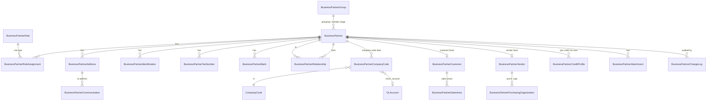
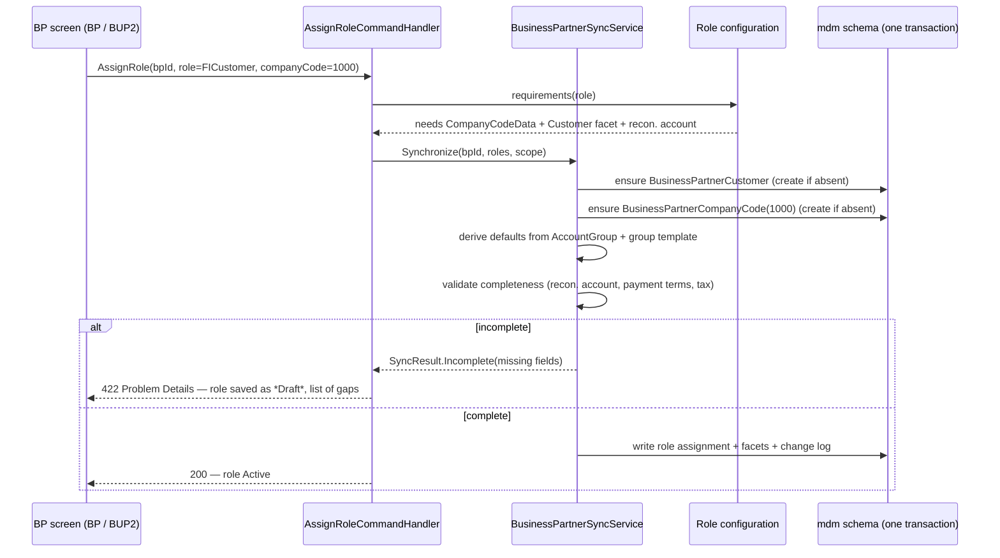

# 4. Business Partner & Customer/Vendor Synchronization

## 4.1 The core decision

**One identity, many roles.** A Business Partner (BP) is the single record of a
legal or natural person the enterprise deals with. "Customer" and "Vendor" are
*roles* on that identity, not separate identities (§6). A BP that both buys from
us and sells to us is **one** `mdm.BusinessPartner` row with two role assignments
and two facet records — never two masters joined by a convention.

Consequences that shape the whole model:

- Every financial transaction references `BusinessPartnerId` **plus** the role it
  was posted under (`Customer` or `Vendor`) — never a separate customer number as
  the primary key of the relationship.
- Legacy-style account numbers (`CustomerAccountNumber`, `VendorAccountNumber`)
  still exist, because printed documents, bank files, and migrations need them —
  but they are *attributes of the facet*, alternate keys, not the identity.
- Blocking, deletion flags, and reconciliation accounts are **per company code**,
  because a BP can be active in one company code and blocked in another.

## 4.2 Entity-relationship model (mdm schema)



### Table catalogue

| Table | Purpose | Key fields |
|---|---|---|
| `mdm.BusinessPartner` | Identity root | `BusinessPartnerNumber` (alt key), `Category` (Organization/Person/Group), `GroupId`, `Title`, name fields, `SearchTerm1/2`, `RegistrationNumber`, `IndustryId`, `LanguageCode`, `Status`, `ValidFrom/To`, `IsBlocked`, `IsMarkedForArchiving` |
| `mdm.BusinessPartnerRole` | Role catalogue (config) | `RoleKey`, name, `Category` (General/Customer/FICustomer/Vendor/FIVendor/Employee/ContactPerson/Bank/Intercompany), `RequiresCompanyCodeData`, `RequiresSalesArea`, `RequiresPurchOrg` |
| `mdm.BusinessPartnerRoleAssignment` | Which roles a BP holds | `BusinessPartnerId`, `RoleId`, `ValidFrom`, `ValidTo`, `AssignedAt/By` |
| `mdm.BusinessPartnerGroup` | Grouping → number range, screen layout | `GroupKey`, `NumberRangeId`, `IsExternalNumbering`, `DefaultCategory` |
| `mdm.BusinessPartnerAddress` | N addresses, validity-dated | `UsageType` (Standard/Bill-to/Ship-to/Remit-to/Legal/Tax), `IsDefault`, full postal fields, `CountryCode`, `Region`, `TaxJurisdictionId`, `ValidFrom/To` |
| `mdm.BusinessPartnerCommunication` | Phone / mobile / fax / email / website | `AddressId?`, `CommunicationType`, `Value`, `IsDefault`, `Notes` |
| `mdm.BusinessPartnerIdentification` | Passport, national ID, business licence, VAT cert. | `IdentificationType`, `Number`, `IssuingAuthority`, `IssuingCountry`, `ValidFrom/To` |
| `mdm.BusinessPartnerTaxNumber` | Tax numbers per country/type | `CountryCode`, `TaxNumberType`, `TaxNumber`, `IsPrimary` |
| `mdm.BusinessPartnerBank` | Bank accounts for payment | `BankCountry`, `BankKey`, `BankName`, `AccountNumber`, `IBAN`, `SWIFT`, `AccountHolder`, `CurrencyCode`, `IsDefault`, `ValidFrom/To` |
| `mdm.BusinessPartnerRelationship` | Validity-dated relationships | `FromBpId`, `ToBpId`, `RelationshipTypeId`, `ValidFrom/To`, `IsStandard` |
| `mdm.BusinessPartnerRelationshipType` | Catalogue (config) | Parent company, Subsidiary, Contact person, Employee of, Sold-to, Ship-to, Bill-to, Payer, Supplier, Related company, Intercompany partner; `IsDirectional`, `InverseTypeId` |
| `mdm.BusinessPartnerCompanyCode` | §6.4 data | `CompanyCodeId`, `CustomerReconciliationAccountId`, `VendorReconciliationAccountId`, `PaymentTermsId`, `PaymentMethods`, `DunningProcedureId`, `DunningLevel`, `ToleranceGroupId`, `WithholdingTaxCodeId`, `IsPaymentBlocked`, `IsPostingBlocked`, `ClearingRule`, `CorrespondenceType`, `HouseBankId`, `SortKey` |
| `mdm.BusinessPartnerCustomer` | §6.5 facet | `CustomerAccountNumber` (alt key), `AccountGroupId`, `CreditControlAreaId`, `CustomerClassification`, `IsOneTimeAccount` |
| `mdm.BusinessPartnerVendor` | §6.6 facet | `VendorAccountNumber` (alt key), `AccountGroupId`, `IsOneTimeAccount`, `IsSubjectToWithholding` |
| `mdm.BusinessPartnerSalesArea` | Per sales org/channel/division | `PricingProcedureId`, `ShippingConditionId`, `DeliveryPriority`, `Incoterms`, `CustomerPaymentTermsId`, `CurrencyCode`, `IsBlocked` |
| `mdm.BusinessPartnerPurchasingOrganization` | Per purchasing org | `PurchasingGroupId`, `OrderCurrency`, `Incoterms`, `PaymentTermsId`, `IsGrBasedInvoiceVerification`, `IsGoodsReceiptExpected`, `IsAutoPoAllowed`, `IsBlocked` |
| `mdm.BusinessPartnerCreditProfile` | Per credit control area | `CreditLimit decimal(19,4)`, `CurrencyCode`, `RiskCategory`, `CheckRule`, `LimitValidTo`, `LastReviewDate` |
| `mdm.BusinessPartnerAttachment` | Documents | `FileName`, `ContentType`, `SizeBytes`, `StorageKey`, `DocumentType`, `UploadedAt/By` |
| `mdm.BusinessPartnerChangeLog` | Field-level history | `EntityName`, `EntityId`, `FieldName`, `OldValue`, `NewValue`, `ChangedAt/By`, `ChangeRequestId?` |

Categories, roles, relationship types, and identification types are
**configuration**, so a new role can be introduced without a schema change.

## 4.3 Number assignment

`mdm.BusinessPartnerGroup` points to a number range. Internal numbering draws
from `cfg.NumberRange` through the same concurrency-safe service as document
numbers ([06 §6.4](06-posting-engine.md)). External numbering validates a
caller-supplied number against the range mask.

Customer and vendor account numbers: by default **the BP number is reused** for
both facets (one identity, one number — the cleanest outcome). A per-group option
`SeparateFacetNumbering` allows legacy-style distinct ranges when a migration
requires it; the facet number is then an alternate key, never used as an FK.

## 4.4 Customer/Vendor synchronization design (§6.8)

The synchronization requirement is: *"Adding a customer or vendor role must
create or update the required role-specific information without duplicating the
general identity."*

### Design: role-driven facet provisioning, in-transaction, idempotent

Synchronization is **not** a nightly reconciliation between two masters (there is
only one master). It is a domain service that, on any role change, brings the
dependent facet records to the state the role requires.



**Key properties**

1. **One transaction.** Role assignment and facet provisioning commit together.
   There is no window in which a BP holds the FI-Customer role without company
   code data.
2. **Idempotent.** `Synchronize` is a *converge to desired state* operation:
   running it twice changes nothing. It is also exposed as `BP_SYNC` so an
   administrator can re-converge after a data migration.
3. **Completeness gate.** A role whose mandatory facet fields are unfilled is
   stored with `RoleAssignment.Status = Draft` and **cannot be used in posting**.
   The posting engine checks role status, not just role existence.
4. **Defaults come from configuration**, not code: account group → default
   reconciliation account, payment terms, tolerance group, sort key.
5. **Removal is a delimitation, never a delete.** Ending a role sets `ValidTo`;
   facet data is retained because posted documents reference it. A role cannot be
   delimited to a date at which open items still exist.

### Consistency check (`BP_CHECK`)

A read-only diagnostic (also runnable as a Hangfire job across all BPs) that
reports, per BP:

| Check | Severity |
|---|---|
| Role requires company-code data that is missing | Error |
| Company-code data without a reconciliation account | Error |
| Reconciliation account is not flagged as a reconciliation account, or its account type contradicts the role | Error |
| Customer facet exists but no Customer/FI-Customer role assigned | Warning |
| Vendor facet exists but no Vendor/FI-Vendor role assigned | Warning |
| Sales-area data for a sales area not defined in Organization | Error |
| Bank account missing for a payment method that requires it | Error |
| Credit profile missing while credit-limit check is active | Warning |
| Duplicate candidate: same tax number / registration number in the tenant | Warning |
| Posting-blocked BP with open items | Info |

Errors block posting for the affected BP + company code; warnings do not.

## 4.5 The BP screen (§6.9)

Single page, tabbed, one save (`BP` / `BUP1` / `BUP2` / `BUP3`):

```
┌ Business Partner  1000047  ·  "Mekong Rice Traders Co., Ltd."  ·  Organization ┐
│ Roles: [General ✓] [FI Customer ✓] [Vendor ✓] [+ Add role]      Status: Active │
│ Scope: Company code [1000 ▾]  Sales area [1000/10/00 ▾]  Purch. org [1000 ▾]  │
├───────────────────────────────────────────────────────────────────────────────┤
│ General │ Addresses │ Communication │ Identification │ Tax │ Banks │           │
│ Relationships │ Company Code │ Customer │ Vendor │ Sales Area │ Purchasing │   │
│ Credit │ Attachments │ Change History │                                        │
└───────────────────────────────────────────────────────────────────────────────┘
```

Behaviours:

- Tabs appear **only** for roles the BP holds; adding a role reveals its tabs
  immediately (client-side, from the role configuration contract).
- Company-code / sales-area / purchasing-org tabs are **scoped** by the selector
  in the header — the same pattern used everywhere in the app.
- Field labels, help text (F1), value helps (F4), and required-field marking come
  from the Data Dictionary ([07](07-data-dictionary.md)), not from hard-coded JSX.
- Change History tab reads `mdm.BusinessPartnerChangeLog` — field, old, new, who,
  when — and is available in display mode (`BUP3`) for auditors.
- Custom fields (`ZZ*`) render in their configured screen section
  ([09](09-customization-framework.md)).

### T-codes

| T-Code | Function | Authorization activity |
|---|---|---|
| `BP` | Create/change/display BP (mode-switching single page) | 01/02/03 |
| `BUP1` | Create Business Partner | 01 |
| `BUP2` | Change Business Partner | 02 |
| `BUP3` | Display Business Partner | 03 |
| `BP_ROLE` | Maintain roles | 02 |
| `BP_SYNC` | Re-run synchronization | 02 (admin) |
| `BP_CHECK` | Consistency check | 03 |

## 4.6 How transactions reference a BP

Every subledger line carries:

```
BusinessPartnerId      uniqueidentifier   → mdm.BusinessPartner
BusinessPartnerRole    tinyint            (1 = Customer, 2 = Vendor)
ReconciliationAccountId uniqueidentifier  → fin.GLAccount (snapshot at posting time)
```

The reconciliation account is **snapshotted onto the line**, not resolved at read
time. If configuration later changes the BP's reconciliation account, historical
documents still reconcile to the G/L account they actually posted to — the
subledger-to-G/L reconciliation test (§23) depends on this.

## 4.7 Sample data (§24)

| BP | Category | Roles | Note |
|---|---|---|---|
| 1000001 Mekong Rice Traders Co., Ltd. | Organization | General, FI Customer, Customer | KHR, credit limit 500,000 USD in CCA1 |
| 1000002 Bangkok Agro Supplies Ltd. | Organization | General, FI Vendor, Vendor | THB, withholding tax |
| 1000003 Angkor Logistics Co., Ltd. | Organization | General, Customer, **Vendor** | **both roles** — freight in, warehousing out |
| 1000004 Sophea Chan | Person | General, Contact Person | contact of 1000001 |
| 1000005 KSS Trading (CC 1100) | Organization | General, Intercompany Partner | intercompany pair with CC 1000 |
| 1000006 Cambodia Commercial Bank | Organization | General, Bank | house bank for CC 1000 |
