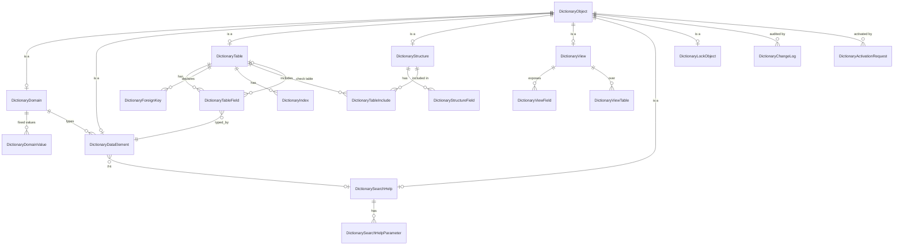
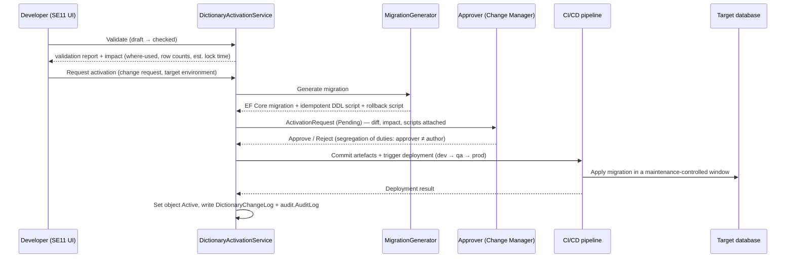

# 7. Data Dictionary (SE11-like) — Metadata Architecture

An original, web-based dictionary that serves the *purpose* of SAP SE11: a single
description of every data object, from which labels, help, value helps,
validation, table browsing, and change control all derive.

## 7.1 Why the dictionary is the foundation, not a viewer

The dictionary is not documentation about the database — it is **the runtime
contract** consumed by:

| Consumer | What it takes from the dictionary |
|---|---|
| React UI | Field labels (short/medium/long), F1 help, required/optional, length, decimals, input mask, value list (F4) |
| API layer | DTO field descriptions in OpenAPI, validation limits |
| FluentValidation | Generated rules for length, range, fixed values, check-table existence |
| SE16N table browser | Which tables/views are browsable, which fields are visible, which are masked, foreign-key navigation targets |
| Customization | Data type / domain / element definitions reused by custom tables and fields |
| Reporting | Column headings, drill-down targets, export formatting |
| Audit | Which fields are change-logged, which are sensitive |

A field therefore exists in the dictionary **before** it exists on a screen.

## 7.2 Object model



### The three-level typing chain

```
Domain            technical type      →  ZDOM_AMOUNT    decimal(19,4), sign allowed
   ▲                                     ZDOM_CURRKEY   char(3), fixed values from cfg.Currency
   │
Data element      business meaning    →  ZDE_LOCAL_AMOUNT
   ▲                                     labels: "Loc.Amt" / "Local amount" /
   │                                              "Amount in company code currency"
   │                                     help: "The document amount translated…"
Table field       usage in a table     →  fin.JournalEntryLine.AmountLocal
```

One domain change (e.g. adding a fixed value) propagates to every data element
and every field that uses it — that is the entire point of the chain and why the
UI must read labels from the dictionary rather than from hard-coded strings.

## 7.3 Metadata tables (`cfg` schema)

| Table | Key content |
|---|---|
| `cfg.DictionaryObject` | `ObjectName`, `ObjectType` (Domain/DataElement/Table/Structure/View/SearchHelp/LockObject/Index), `Status`, `Package`, `Namespace` (`CORE`/`Z`/`Y`), `AuthorizationGroup`, `Version`, `IsCustom`, description, `CreatedAt/By`, `ActivatedAt/By` |
| `cfg.DictionaryDomain` | `DataType` (Char/NVarChar/Int/BigInt/Decimal/Date/DateTime2/Bit/Guid/Binary), `Length`, `DecimalPlaces`, `IsSigned`, `ValueRangeLow/High`, `ConversionRoutine`, `CaseSensitive`, `OutputMask` |
| `cfg.DictionaryDomainValue` | `DomainId`, `Value`, `Description`, `SortOrder`, `IsDefault`, `ValidFrom/To` |
| `cfg.DictionaryDataElement` | `DomainId`, `ShortLabel`, `MediumLabel`, `LongLabel`, `HeadingLabel`, `Description`, `HelpText`, `SearchHelpId`, `IsSensitive`, `IsChangeLogged`, `DefaultValue` |
| `cfg.DictionaryDataElementText` | Translations per `LanguageCode` (en, km) |
| `cfg.DictionaryTable` | `SchemaName`, `TableName`, `TableCategory` (Transparent/Configuration/Master/TransactionHeader/TransactionItem/Translation/History/Relationship), `DeliveryClass`, `IsTenantDependent`, `IsCompanyCodeDependent`, `IsAuditEnabled`, `IsSoftDeletable`, `MaintenanceAllowed`, `BrowsableInTableBrowser`, `MaxBrowseRows` |
| `cfg.DictionaryTableField` | `TableId`, `Position`, `FieldName`, `DataElementId`, `SqlDataType`, `Length`, `DecimalPlaces`, `IsKey`, `IsRequired`, `IsNullable`, `DefaultValue`, `CheckTableId`, `SearchHelpId`, `IsMasked`, `MaskingRule`, `IsBrowsable`, `IncludeStructureId?` |
| `cfg.DictionaryStructure` / `cfg.DictionaryStructureField` | Reusable field groups (e.g. `ZSTR_AUDIT_FIELDS`, `ZSTR_ORG_ASSIGNMENT`) |
| `cfg.DictionaryTableInclude` | Structure included into a table, with position and optional field prefix |
| `cfg.DictionaryView` / `cfg.DictionaryViewField` / `cfg.DictionaryViewTable` | View definition: base tables, join conditions, exposed fields, `ViewType` (Database/Projection/Help/Maintenance), `SelectionConditions` |
| `cfg.DictionaryForeignKey` | `TableId`, `FieldName`, `CheckTableId`, `CheckField`, `Cardinality`, `IsScreenChecked`, `OnDeleteBehaviour` |
| `cfg.DictionaryIndex` | `TableId`, `IndexName`, `IsUnique`, `IsClustered`, fields with sort order, `IncludedColumns`, `FilterExpression` |
| `cfg.DictionarySearchHelp` | `SearchHelpType` (Elementary/Collective), `SelectionMethod` (table/view), `DialogType`, `ExportField`, `HotKey` |
| `cfg.DictionarySearchHelpParameter` | `Position`, `FieldName`, `IsImport`, `IsExport`, `IsListDisplay`, `IsSelectionDisplay`, `DefaultValue` |
| `cfg.DictionaryLockObject` | `LockObjectName`, `PrimaryTableId`, `LockMode` (Exclusive/Shared/ExclusiveCumulative), lock parameters — used for application-level locking of master data during maintenance |
| `cfg.DictionaryChangeLog` | Every definition change: object, version, field, old, new, changed by/at, change request |
| `cfg.DictionaryActivationRequest` | The activation workflow record — see §7.6 |
| `cfg.DictionaryTechnicalSettings` | `TableId`, size category, buffering (none/single/generic/full), `PartitionScheme`, `CompressionType`, `ArchivingClass` |

## 7.4 Object lifecycle

```
 Draft ──validate──► Checked ──approve+deploy──► Active ──► Inactive ──► Deprecated
   ▲                    │                          │
   └──── change ────────┘                          └── new version → Draft (v+1)
```

| Status | Meaning |
|---|---|
| **Draft** | Editable; not visible to runtime consumers |
| **Checked** | Passed all syntax/consistency validations; still not runtime-visible |
| **Active** | Deployed and in use by UI/API/browser |
| **Inactive** | Temporarily withdrawn; existing data untouched, object hidden |
| **Deprecated** | Superseded; readable, flagged in dependency views, blocked for new use |

Actions available per object (§10): Create · Copy · Change · Display · Validate ·
Compare (two versions or two environments) · Activate · Deactivate ·
View dependencies (where-used) · View SQL definition · View change history.

## 7.5 Validation rules (the "Check" action)

Run in order; any error blocks progression to `Checked`:

1. Naming — namespace correct (`Z*`/`Y*` for custom, core namespace protected),
   valid SQL identifier, no reserved core name (§23 mandatory test).
2. Key — at least one key field; key fields not nullable; `TenantId` present and
   first key for tenant-dependent tables.
3. Types — every field has a data element; the data element has a domain; SQL type
   matches the domain; decimals within the domain's declared precision.
4. Standard fields — required audit fields present for the table category
   ([09 §9.4](09-customization-framework.md)).
5. Foreign keys — check table exists and is Active; check field is a key field of
   the check table; type compatibility; no cycle that would deadlock inserts.
6. Indexes — no duplicate index definitions; key index implied; column count and
   total width within SQL Server limits.
7. Search helps — export field belongs to the selection method; parameters typed.
8. Dependencies — where-used analysis; changing a domain's type or shortening a
   length is flagged as **incompatible** and requires an impact review.
9. Data compatibility — for a change on a table that already holds rows: is the
   change additive (nullable column, new index) or destructive (type narrowing,
   key change)? Destructive changes require an explicit data-migration script
   attached to the activation request.

## 7.6 Activation — controlled, never ad-hoc DDL

> **Hard rule (§10):** the web interface never executes DDL against production.



- **Development environment only** may be configured with `AllowDirectApply =
  true`, and even then the operation is transactional, logged, and blocked for
  core-namespace objects.
- Generated artefacts are **reviewed code**, committed to the repository, so the
  database schema history lives in version control like everything else.
- Rollback scripts are generated at the same time and stored on the request.
- An activation that would drop a column or table is rejected outright for tables
  containing posted financial data.

## 7.7 SE11 user interface

```
┌ Data Dictionary (SE11) ───────────────────────────────────────────────────────┐
│ Object type [Table ▾]  Name [fin.JournalEntryLine        ] [Display][Change]  │
│ ┌ Tree ─────────────┐ ┌ fin.JournalEntryLine · Active · v7 ─────────────────┐ │
│ │ ▾ Tables          │ │ [Fields][Keys][Foreign Keys][Indexes][Includes]     │ │
│ │   ▾ fin           │ │ [Technical][SQL][Where-Used][History][Dependencies] │ │
│ │     JournalEntry… │ │──────────────────────────────────────────────────── │ │
│ │     OpenItem      │ │ Pos Field         DataElement    Type      Key Req  │ │
│ │   ▸ mdm           │ │  1  TenantId      ZDE_TENANT     uniqueid.  ✓   ✓   │ │
│ │ ▸ Views           │ │  2  JournalHdrId  ZDE_DOCID      uniqueid.  ✓   ✓   │ │
│ │ ▸ Data elements   │ │  3  LineNumber    ZDE_LINENO     int        ✓   ✓   │ │
│ │ ▸ Domains         │ │  4  AmountLocal   ZDE_LOC_AMOUNT dec(19,4)      ✓   │ │
│ │ ▸ Search helps    │ │ …                                                   │ │
│ └───────────────────┘ └─────────────────────────────────────────────────────┘ │
│ Status: Active   Package: FIN_CORE   Auth. group: FIN   [Validate][Activate]  │
└───────────────────────────────────────────────────────────────────────────────┘
```

Every core table ships with its dictionary definition **seeded** (Phase 2
deliverable), so SE11 and SE16N work against core objects from day one — the
dictionary is not a bolt-on for custom objects only.

## 7.8 Runtime metadata provider

```csharp
public interface IDictionaryMetadataProvider
{
    TableMetadata GetTable(string schema, string table);
    FieldMetadata GetField(string schema, string table, string field);
    IReadOnlyList<ValueHelpItem> GetSearchHelpValues(string searchHelpName, ValueHelpQuery q);
    LocalizedLabels GetLabels(string dataElement, string languageCode);
}
```

- Backed by `IMemoryCache`, invalidated by the `DictionaryObjectActivated`
  integration event.
- Exposed to the SPA at `GET /api/v1/dictionary/metadata/{schema}/{table}` so the
  React field components (`<DictField name="fin.JournalEntryLine.AmountLocal"/>`)
  render label, help, mask, and F4 without bespoke per-screen code.
- **Never** consulted on the hot posting path for anything other than field-status
  and validation rules already loaded into the configuration cache.

## 7.9 Authorization

| Action | Permission | Notes |
|---|---|---|
| Display | `DICT_DISPLAY` + object authorization group | Auditors get this by default |
| Create/Change draft | `DICT_MAINTAIN` | Custom namespace only, unless `DICT_CORE` |
| Validate | `DICT_MAINTAIN` | |
| Request activation | `DICT_ACTIVATE_REQUEST` | |
| Approve activation | `DICT_ACTIVATE_APPROVE` | **Cannot be the requester** (SoD rule) |
| Deploy to production | pipeline identity only | No human path from the UI |
