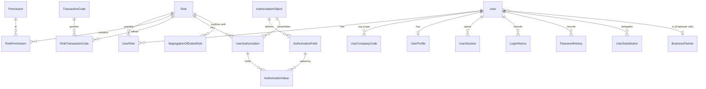

# 10. User & Authorization Model

## 10.1 The authorization question

Role-based access control alone is not enough for an ERP. "Can this user post a
journal entry?" is the wrong question. The right one is:

> **Can this user perform _activity_ (post) on _transaction code_ (FB50)
> in _company code_ 1000, for _cost center_ CC-FIN, on a document they did not
> themselves create?**

So authorization is evaluated as a tuple:

```
DECISION = f( user , transaction code , activity , organizational scope , object state )
```

## 10.2 Model



### Tables (`sec` schema, §18)

| Table | Content |
|---|---|
| `sec.User` | `UserName`, `EmployeeNumber`, `BusinessPartnerId`, `FullName`, `Email`, `UserType`, `IsLocked`, `LockReason`, `FailedLoginCount`, `LastLoginAt`, `ValidFrom`, `ValidTo`, `MustChangePassword`, `MfaEnabled`, audit fields |
| `sec.UserProfile` | `LanguageCode` (en/km), `TimeZoneId` (IANA), `DateFormat`, `NumberFormat`, `DecimalSeparator`, `DefaultCompanyCodeId`, `DefaultControllingAreaId`, `DefaultLedgerId`, `Theme` (light/dark/system), `StartPage`, `Favorites` |
| `sec.UserCompanyCode` | User × company code, with `IsDefault` and validity dates |
| `sec.UserOrgScope` | Generalized scope: `ScopeType` (CompanyCode/CostCenter/ProfitCenter/Plant/BusinessArea/ControllingArea), `ScopeValueFrom`, `ScopeValueTo`, `IsExclusion` |
| `sec.Role` | `RoleKey`, name, description, `RoleType` (Single/Composite), `IsSystemRole`, validity |
| `sec.CompositeRoleMember` | Composite role → single roles |
| `sec.Permission` | `PermissionKey` (e.g. `FIN.JOURNAL.POST`), module, description |
| `sec.RolePermission` | Role × permission |
| `sec.TransactionCode` | `TCode`, name, `Route` (SPA path), `ModuleKey`, `AuthorizationObjectId`, `DefaultActivity`, `IsActive`, `IconKey` |
| `sec.RoleTransactionCode` | Role × T-code × allowed activities |
| `sec.AuthorizationObject` | e.g. `F_JOURNAL`, `S_TABLE`, `BP_MASTER`, `CO_COSTCTR` |
| `sec.AuthorizationField` | Fields of an object (`ACTIVITY`, `COMPANYCODE`, `DOCTYPE`, `AMOUNT_LIMIT`, `AUTH_GROUP`) |
| `sec.UserAuthorization` | An instance of an object granted to a role/user |
| `sec.AuthorizationValue` | Values per field: single, range, wildcard, exclusion |
| `sec.LoginHistory` | Timestamp, IP, user agent, result, failure reason, MFA method |
| `sec.UserSession` | Session id, issued/expires, refresh token hash, IP, device, `RevokedAt` |
| `sec.PasswordHistory` | Hashes of the previous N passwords (reuse prevention) |
| `sec.UserSubstitution` | Substitute user, scope (approvals/all), validity, `IsActive` — powers delegation in workflow |
| `sec.SegregationOfDutiesRule` | Conflicting permission/T-code pairs, severity, mitigation note, `IsBlocking` |
| `sec.RowLevelPolicy` | Table, predicate template, applicable roles — consumed by SE16N and reporting |

### Activities

`01` Create · `02` Change · `03` Display · `04` Print · `06` Delete (master data
only) · `10` Post · `43` Approve · `85` Reverse · `A7` Export · `A9` Report ·
`F4` Value help

## 10.3 User types (§18)

| Type | Interactive login | Password policy | Typical use |
|---|---|---|---|
| Dialog | yes | full policy, expiry, MFA | People |
| Service | no | long secret, no expiry | Internal service-to-service |
| Integration | no | client credentials / mTLS | Bank, payroll, external ERP |
| API | no | API key + scope, rotated | Partner API consumers |
| Background | no | none (managed identity) | Hangfire jobs |
| Auditor (read-only) | yes | full policy | Display + report + browse only; **no activity ≥ 01** |

Background jobs run as a background user whose authorizations are **explicit** —
a depreciation run is authorized to post document type `AF` in specific company
codes, nothing else. No "system runs as god" account.

## 10.4 Evaluation at runtime

```csharp
public interface IAuthorizationService
{
    Task<AuthResult> CheckAsync(AuthorizationRequest r, CancellationToken ct);
}

public sealed record AuthorizationRequest(
    string TransactionCode, Activity Activity,
    Guid? CompanyCodeId = null, Guid? CostCenterId = null,
    Guid? ProfitCenterId = null, string? DocumentType = null,
    Money? Amount = null, Guid? OwnerUserId = null);   // OwnerUserId → maker-checker
```

Three enforcement points, deliberately redundant:

1. **API/command layer** — `AuthorizationBehaviour` in the MediatR pipeline reads
   the command's declared `[RequiresAuthorization]` metadata and calls the
   service. A command without that attribute fails an architecture test.
2. **Query layer** — EF Core global query filters for tenant, and
   `IOrgScopeProvider` predicates injected into repository queries and every
   reporting/table-browser query. **Data the user may not see is never
   materialized.**
3. **UI** — navigation, buttons, and tabs are hidden per permission. This is
   usability, *never* security: the server re-checks everything.

## 10.5 Maker-checker (§18)

> *"A user must not approve their own document when maker-checker control is
> enabled."*

- `wf.WorkflowRule.EnforceMakerChecker` (default `true` for all financial
  document types).
- The check compares the approval step's actor against the document's
  `CreatedBy` **and** `SubmittedBy`, and against any user who edited it while
  parked.
- Substitution does not launder it: if user A substitutes for user B, A still
  cannot approve a document A created.
- Break-glass: a `MAKER_CHECKER_OVERRIDE` permission exists for genuine
  emergencies, is never granted in the default role set, requires a reason text,
  and produces a high-severity audit record plus a real-time notification to the
  security administrator.

Covered by `MakerCheckerTests` (§23).

## 10.6 Segregation of duties

`sec.SegregationOfDutiesRule` declares conflicting capability pairs, e.g.:

| Conflict | Risk |
|---|---|
| Maintain vendor master **and** run payment | Fictitious vendor fraud |
| Post journal **and** approve journal | Unreviewed postings |
| Maintain G/L account **and** post to it without review | Concealment |
| Maintain user roles **and** post financial documents | Privilege self-grant |
| Execute payment run **and** maintain house bank details | Payment diversion |

Enforced at **role assignment time** (blocking rules refuse the assignment;
non-blocking rules require a documented mitigation), and re-evaluated by a
scheduled job that reports drift after role changes. An SoD report is part of the
audit report set.

## 10.7 Authentication

- **ASP.NET Core Identity** as the user/credential store (with a custom
  `IUserStore` mapping to `sec.User`).
- **JWT** for the SPA and API clients; **OpenID Connect** for enterprises with an
  external IdP (Entra ID, Keycloak). Both produce the same claim set, so the
  application layer is identical:

```
sub, tenant_id, user_name, user_type, lang, tz,
default_company_code, roles[], permissions[] (hashed reference), session_id
```

Claims carry role and permission *references*, not the full org scope — scope is
resolved server-side per request from `sec.UserOrgScope` (a user with 400 cost
centers must not carry a 40 KB token).

- **Refresh tokens** rotate, are stored hashed in `sec.UserSession`, and are
  revoked on logout, password change, role change, or lock.
- **MFA** (TOTP + recovery codes) supported; enforceable per role — mandatory by
  default for roles holding `F110` (payment run) or user administration.
- **Password policy**: configurable minimum length (default 12), complexity,
  history (default 5), expiry, lockout after N failures with exponential backoff.
  Hashing: ASP.NET Core Identity v3 (PBKDF2) or Argon2id via a custom hasher.

## 10.8 OWASP alignment (§26.11)

| Risk | Control |
|---|---|
| Broken access control | Three-layer enforcement (§10.4); deny-by-default; org scope in the query, not after it |
| Injection | No dynamic SQL from user input anywhere; parameterized queries; SE16N safe builder ([08](08-table-browser.md)); EF parameterization |
| Cryptographic failures | TLS everywhere; secrets in a secret store (never `appsettings`); hashed tokens at rest; column encryption (Always Encrypted) for bank account numbers and identification numbers |
| Insecure design | Immutable ledger, maker-checker, SoD, idempotency, audit — designed in, not added |
| Security misconfiguration | Hardened defaults, Swagger disabled outside Development, detailed errors never returned to clients (Problem Details carry a code + correlation id only) |
| Vulnerable components | Dependabot + `dotnet list package --vulnerable` + `npm audit` in CI, build fails on high severity |
| Auth failures | Lockout, MFA, session revocation, rotation, no user enumeration in login errors |
| Data integrity failures | Signed artefacts, migrations reviewed in VCS, no unsigned dynamic code execution — expression rules are parsed, never compiled from user text |
| Logging/monitoring failures | `audit.AuditLog` + `audit.SensitiveAccessLog`, alerting on denied-authorization spikes and break-glass use |
| SSRF | Outbound integration targets whitelisted per tenant in `intg.*` |

Additional: rate limiting per user/IP on auth and export endpoints; strict CORS;
CSP and security headers on the SPA host; antiforgery for cookie-based flows.

## 10.9 Audit trail (`audit` schema)

| Table | Content |
|---|---|
| `audit.AuditLog` | `EntityName`, `EntityId`, `Action` (Create/Change/Delete/Post/Reverse/Approve/Reject/Login/Export/ConfigChange), `UserId`, `OccurredAt` (UTC), `CorrelationId`, `ClientIp`, `TransactionCode`, `Reason`, `SnapshotHash` |
| `audit.AuditLogField` | Field-level: `FieldName`, `OldValue`, `NewValue` (masked for sensitive fields) |
| `audit.SensitiveAccessLog` | Reads of sensitive data (bank details, ID numbers, salary-related), unmasking events |
| `audit.TableBrowserQueryLog` | See [08 §8.7](08-table-browser.md) |
| `audit.AuthorizationDenialLog` | Every 403 with the failing object/field/value |

Properties: **insert-only** (no update/delete grants for the application user;
enforced by database permissions, not just by code), tenant-scoped,
retention-configurable with an archival path, and captured inside the posting
transaction so an audit record can never be missing for a posted document.

## 10.10 Default role set (shipped, §24)

| Role | Contains |
|---|---|
| `SYS_ADMIN` | User/role administration, dictionary display; **no posting permissions** (SoD) |
| `CONFIG_ADMIN` | SPRO configuration, number ranges, document types; no posting |
| `GL_ACCOUNTANT` | FB50/FB01/FB03, FBL3N, park + post within limit, display all FI |
| `AR_ACCOUNTANT` | Customer invoices, incoming payments, dunning, FBL5N |
| `AP_ACCOUNTANT` | Vendor invoices, outgoing payments, FBL1N; **not** payment-run execution |
| `PAYMENT_OFFICER` | F110 execution + bank file generation; **not** vendor master maintenance |
| `ASSET_ACCOUNTANT` | AS01–AS03, AFAB, asset reports |
| `CONTROLLER` | Cost/profit centers, internal orders, allocations, settlement, CO reports |
| `FINANCE_MANAGER` | Approvals above threshold, period close, all display |
| `MASTER_DATA_CLERK` | BP maintenance, G/L account maintenance; no posting |
| `AUDITOR` | Display + reports + SE16N (read-only, masked) + audit reports |
| `INTEGRATION` | API user for external systems, scoped to specific endpoints |

Each ships with its authorization values pre-populated for the sample enterprise
structure, and the pair `AP_ACCOUNTANT` + `PAYMENT_OFFICER` is declared an SoD
conflict — a deliberate demonstration that the rules are real.
