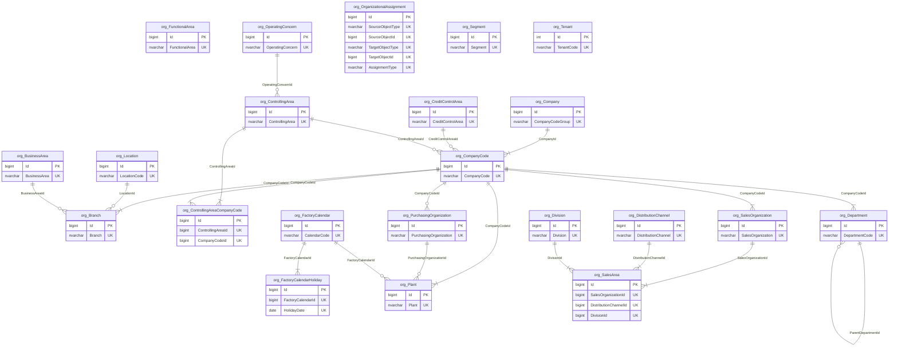
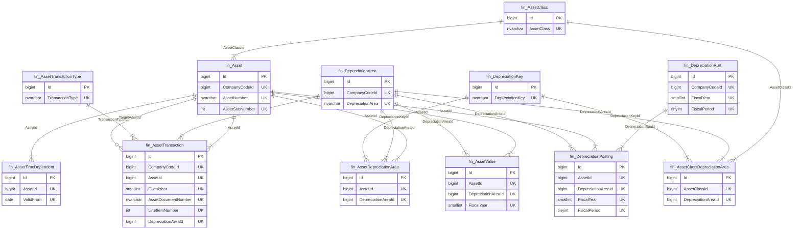

# 11 — Entity Relationships

Generated from the resolved foreign keys, so these diagrams and
`database/s4hana/90_foreign_keys.sql` always describe the same model.
Regenerate with `python3 tools/generate_erd.py`.

One diagram per catalogue file. Entities list their primary key (`PK`)
and business key (`UK`); every other column is in the catalogue itself.
A solid line is a required reference, a circle-ended line an optional one.

Two edge sets are omitted from every diagram to keep them readable:

* **Tenant** — 226 of 228 tables carry
  `TenantId` with a foreign key to `org.Tenant`.
* **Code tables** — 108 business-key references to
  `cfg.Currency`, `cfg.Country`, `cfg.Language`, `cfg.UnitOfMeasure`,
  `cfg.PostingKey`, `cfg.Region`, `cfg.TableAuthorizationGroup`,
  `mdm.Bank` and `org.Company` (trading partner).

## Contents

1. [Enterprise structure](#1-enterprise-structure)
2. [Configuration](#2-configuration)
3. [Data dictionary, table browser, custom objects](#3-data-dictionary-table-browser-custom-objects)
4. [Business Partner and master data](#4-business-partner-and-master-data)
5. [Financial accounting](#5-financial-accounting)
6. [Asset accounting](#6-asset-accounting)
7. [Controlling](#7-controlling)
8. [Workflow, security, audit](#8-workflow-security-audit)
9. [Reporting and integration](#9-reporting-and-integration)

## 1. Enterprise structure

Schema `org` - 22 tables, catalogue file [`01_enterprise_structure.md`](01_enterprise_structure.md).

**References into other modules**

| From | Column | To |
|------|--------|----|
| `org.CompanyCode` | `ChartOfAccountsId` | `cfg.ChartOfAccounts` |
| `org.CompanyCode` | `CountryChartOfAccountsId` | `cfg.ChartOfAccounts` |
| `org.ControllingArea` | `ChartOfAccountsId` | `cfg.ChartOfAccounts` |
| `org.CompanyCode` | `FieldStatusVariantId` | `cfg.FieldStatusVariant` |
| `org.CompanyCode` | `FiscalYearVariantId` | `cfg.FiscalYearVariant` |
| `org.ControllingArea` | `FiscalYearVariantId` | `cfg.FiscalYearVariant` |
| `org.OperatingConcern` | `FiscalYearVariantId` | `cfg.FiscalYearVariant` |
| `org.CompanyCode` | `PostingPeriodVariantId` | `cfg.PostingPeriodVariant` |
| `org.Department` | `CostCenterId` | `co.CostCenter` |
| `org.Branch` | `ProfitCenterId` | `co.ProfitCenter` |
| `org.CompanyCode` | `AddressId` | `mdm.Address` |
| `org.Location` | `AddressId` | `mdm.Address` |
| `org.Plant` | `AddressId` | `mdm.Address` |
| `org.SalesOrganization` | `AddressId` | `mdm.Address` |
| `org.Department` | `ManagerBusinessPartnerId` | `mdm.BusinessPartner` |

## 2. Configuration

Schema `cfg` - 45 tables, catalogue file [`02_configuration.md`](02_configuration.md).

```mermaid
erDiagram
    cfg_AccountDeterminationRule {
        bigint Id PK
        bigint ChartOfAccountsId UK
        nvarchar TransactionKey UK
        nvarchar AccountModifier UK
        bigint CompanyCodeId UK
        nvarchar CurrencyCode UK
    }
    cfg_AccountGroup {
        bigint Id PK
        bigint ChartOfAccountsId UK
        nvarchar AccountGroup UK
    }
    cfg_AccountingPrinciple {
        bigint Id PK
        nvarchar AccountingPrinciple UK
    }
    cfg_ChartOfAccounts {
        bigint Id PK
        nvarchar ChartOfAccounts UK
    }
    cfg_CorrespondenceForm {
        bigint Id PK
        nvarchar FormCode UK
        nvarchar LanguageCode UK
    }
    cfg_Country {
        bigint Id PK
        nvarchar CountryCode UK
    }
    cfg_Currency {
        bigint Id PK
        nvarchar CurrencyCode UK
    }
    cfg_CurrencyDecimal {
        bigint Id PK
        nvarchar CurrencyCode UK
    }
    cfg_CurrencyTranslationRatio {
        bigint Id PK
        bigint ExchangeRateTypeId UK
        nvarchar FromCurrencyCode UK
        nvarchar ToCurrencyCode UK
        date ValidFrom UK
    }
    cfg_DocumentType {
        bigint Id PK
        nvarchar DocumentType UK
    }
    cfg_DunningLevel {
        bigint Id PK
        bigint DunningProcedureId UK
        tinyint DunningLevel UK
    }
    cfg_DunningProcedure {
        bigint Id PK
        nvarchar DunningProcedure UK
    }
    cfg_ExchangeRate {
        bigint Id PK
        bigint ExchangeRateTypeId UK
        nvarchar FromCurrencyCode UK
        nvarchar ToCurrencyCode UK
        date ValidFrom UK
    }
    cfg_ExchangeRateType {
        bigint Id PK
        nvarchar ExchangeRateType UK
    }
    cfg_FieldStatusFieldControl {
        bigint Id PK
        bigint FieldStatusGroupId UK
        nvarchar FieldName UK
    }
    cfg_FieldStatusGroup {
        bigint Id PK
        bigint FieldStatusVariantId UK
        nvarchar FieldStatusGroup UK
    }
    cfg_FieldStatusVariant {
        bigint Id PK
        nvarchar FieldStatusVariant UK
    }
    cfg_FinancialStatementNode {
        bigint Id PK
        bigint FinancialStatementVersionId UK
        nvarchar NodeCode UK
    }
    cfg_FinancialStatementNodeAccount {
        bigint Id PK
        bigint FinancialStatementNodeId UK
        nvarchar FromGLAccount UK
    }
    cfg_FinancialStatementVersion {
        bigint Id PK
        nvarchar FinancialStatementVersion UK
    }
    cfg_FiscalPeriod {
        bigint Id PK
        bigint FiscalYearVariantId UK
        smallint FiscalYear UK
        tinyint FiscalPeriod UK
    }
    cfg_FiscalYearVariant {
        bigint Id PK
        nvarchar FiscalYearVariant UK
    }
    cfg_FiscalYearVariantPeriod {
        bigint Id PK
        bigint FiscalYearVariantId UK
        smallint CalendarYear UK
        tinyint CalendarMonth UK
        tinyint CalendarDay UK
    }
    cfg_Language {
        bigint Id PK
        nvarchar LanguageCode UK
    }
    cfg_Ledger {
        bigint Id PK
        nvarchar Ledger UK
    }
    cfg_LedgerCompanyCode {
        bigint Id PK
        bigint LedgerId UK
        bigint CompanyCodeId UK
    }
    cfg_NumberRangeGap {
        bigint Id PK
    }
    cfg_NumberRangeInterval {
        bigint Id PK
        bigint NumberRangeObjectId UK
        nvarchar NumberRangeCode UK
        bigint CompanyCodeId UK
        smallint FiscalYear UK
    }
    cfg_NumberRangeObject {
        bigint Id PK
        nvarchar NumberRangeObject UK
    }
    cfg_PaymentMethod {
        bigint Id PK
        nvarchar CountryCode UK
        nvarchar PaymentMethod UK
    }
    cfg_PaymentTerms {
        bigint Id PK
        nvarchar PaymentTerms UK
    }
    cfg_PaymentTermsInstallment {
        bigint Id PK
        bigint PaymentTermsId UK
        tinyint InstallmentNumber UK
    }
    cfg_PostingKey {
        bigint Id PK
        nvarchar PostingKey UK
    }
    cfg_PostingPeriodControl {
        bigint Id PK
        bigint PostingPeriodVariantId UK
        nvarchar AccountType UK
        nvarchar FromAccount UK
    }
    cfg_PostingPeriodVariant {
        bigint Id PK
        nvarchar PostingPeriodVariant UK
    }
    cfg_Region {
        bigint Id PK
        nvarchar CountryCode UK
        nvarchar RegionCode UK
    }
    cfg_SpecialGLAccount {
        bigint Id PK
        bigint ChartOfAccountsId UK
        bigint SpecialGLIndicatorId UK
        bigint ReconciliationGLAccountId UK
    }
    cfg_SpecialGLIndicator {
        bigint Id PK
        nvarchar AccountType UK
        nvarchar SpecialGLIndicator UK
    }
    cfg_TaxCode {
        bigint Id PK
        nvarchar CountryCode UK
        nvarchar TaxCode UK
    }
    cfg_TaxCodeRate {
        bigint Id PK
        bigint TaxCodeId UK
        nvarchar ConditionType UK
        nvarchar TaxJurisdictionCode UK
        date ValidFrom UK
    }
    cfg_TaxJurisdiction {
        bigint Id PK
        nvarchar TaxJurisdictionCode UK
    }
    cfg_ToleranceGroup {
        bigint Id PK
        bigint CompanyCodeId UK
        nvarchar ToleranceGroup UK
        nvarchar ToleranceType UK
    }
    cfg_UnitOfMeasure {
        bigint Id PK
        nvarchar UnitOfMeasure UK
    }
    cfg_WithholdingTaxCode {
        bigint Id PK
        bigint WithholdingTaxTypeId UK
        nvarchar WithholdingTaxCode UK
    }
    cfg_WithholdingTaxType {
        bigint Id PK
        nvarchar CountryCode UK
        nvarchar WithholdingTaxType UK
    }
    cfg_ChartOfAccounts ||--|{ cfg_AccountDeterminationRule : "ChartOfAccountsId"
    cfg_ChartOfAccounts ||--|{ cfg_AccountGroup : "ChartOfAccountsId"
    cfg_FieldStatusGroup ||--o{ cfg_AccountGroup : "FieldStatusGroupId"
    cfg_ChartOfAccounts ||--o{ cfg_ChartOfAccounts : "GroupChartOfAccountsId"
    cfg_ExchangeRateType ||--|{ cfg_CurrencyTranslationRatio : "ExchangeRateTypeId"
    cfg_NumberRangeObject ||--|{ cfg_DocumentType : "NumberRangeObjectId"
    cfg_DunningProcedure ||--|{ cfg_DunningLevel : "DunningProcedureId"
    cfg_CorrespondenceForm ||--o{ cfg_DunningLevel : "FormId"
    cfg_ExchangeRateType ||--|{ cfg_ExchangeRate : "ExchangeRateTypeId"
    cfg_FieldStatusGroup ||--|{ cfg_FieldStatusFieldControl : "FieldStatusGroupId"
    cfg_FieldStatusVariant ||--|{ cfg_FieldStatusGroup : "FieldStatusVariantId"
    cfg_FinancialStatementVersion ||--|{ cfg_FinancialStatementNode : "FinancialStatementVersionId"
    cfg_FinancialStatementNode ||--o{ cfg_FinancialStatementNode : "ParentNodeId"
    cfg_FinancialStatementNode ||--|{ cfg_FinancialStatementNodeAccount : "FinancialStatementNodeId"
    cfg_ChartOfAccounts ||--o{ cfg_FinancialStatementVersion : "ChartOfAccountsId"
    cfg_AccountingPrinciple ||--o{ cfg_FinancialStatementVersion : "AccountingPrincipleId"
    cfg_FiscalYearVariant ||--|{ cfg_FiscalPeriod : "FiscalYearVariantId"
    cfg_FiscalYearVariant ||--|{ cfg_FiscalYearVariantPeriod : "FiscalYearVariantId"
    cfg_AccountingPrinciple ||--|{ cfg_Ledger : "AccountingPrincipleId"
    cfg_Ledger ||--o{ cfg_Ledger : "UnderlyingLedgerId"
    cfg_Ledger ||--|{ cfg_LedgerCompanyCode : "LedgerId"
    cfg_FiscalYearVariant ||--|{ cfg_LedgerCompanyCode : "FiscalYearVariantId"
    cfg_PostingPeriodVariant ||--|{ cfg_LedgerCompanyCode : "PostingPeriodVariantId"
    cfg_NumberRangeInterval ||--|{ cfg_NumberRangeGap : "NumberRangeIntervalId"
    cfg_NumberRangeObject ||--|{ cfg_NumberRangeInterval : "NumberRangeObjectId"
    cfg_DocumentType ||--o{ cfg_PaymentMethod : "DocumentTypeId"
    cfg_PaymentTerms ||--|{ cfg_PaymentTermsInstallment : "PaymentTermsId"
    cfg_PaymentTerms ||--|{ cfg_PaymentTermsInstallment : "InstallmentPaymentTermsId"
    cfg_FieldStatusGroup ||--o{ cfg_PostingKey : "FieldStatusGroupId"
    cfg_PostingPeriodVariant ||--|{ cfg_PostingPeriodControl : "PostingPeriodVariantId"
    cfg_ChartOfAccounts ||--|{ cfg_SpecialGLAccount : "ChartOfAccountsId"
    cfg_SpecialGLIndicator ||--|{ cfg_SpecialGLAccount : "SpecialGLIndicatorId"
    cfg_SpecialGLAccount ||--|{ cfg_SpecialGLAccount : "SpecialGLAccountId"
    cfg_TaxCode ||--|{ cfg_TaxCodeRate : "TaxCodeId"
    cfg_TaxJurisdiction ||--o{ cfg_TaxJurisdiction : "ParentJurisdictionId"
    cfg_WithholdingTaxType ||--|{ cfg_WithholdingTaxCode : "WithholdingTaxTypeId"
```

**References into other modules**

| From | Column | To |
|------|--------|----|
| `cfg.AccountDeterminationRule` | `CreditGLAccountId` | `mdm.GLAccount` |
| `cfg.AccountDeterminationRule` | `DebitGLAccountId` | `mdm.GLAccount` |
| `cfg.SpecialGLAccount` | `ReconciliationGLAccountId` | `mdm.GLAccount` |
| `cfg.WithholdingTaxCode` | `GLAccountId` | `mdm.GLAccount` |
| `cfg.AccountDeterminationRule` | `CompanyCodeId` | `org.CompanyCode` |
| `cfg.LedgerCompanyCode` | `CompanyCodeId` | `org.CompanyCode` |
| `cfg.NumberRangeInterval` | `CompanyCodeId` | `org.CompanyCode` |
| `cfg.ToleranceGroup` | `CompanyCodeId` | `org.CompanyCode` |

## 3. Data dictionary, table browser, custom objects

Schema `cfg` - 30 tables, catalogue file [`03_data_dictionary.md`](03_data_dictionary.md).

```mermaid
erDiagram
    cfg_BrowserQueryLog {
        bigint Id PK
    }
    cfg_BrowserVariant {
        bigint Id PK
        nvarchar VariantName UK
        nvarchar SchemaName UK
        nvarchar ObjectName UK
        bigint OwnerUserId UK
    }
    cfg_BrowserVariantField {
        bigint Id PK
        bigint BrowserVariantId UK
        nvarchar FieldName UK
    }
    cfg_BrowserVariantFilter {
        bigint Id PK
        bigint BrowserVariantId UK
        nvarchar FieldName UK
        int LineNumber UK
    }
    cfg_CustomFieldDefinition {
        bigint Id PK
        nvarchar HostEntity UK
        nvarchar FieldName UK
    }
    cfg_CustomFieldValue {
        bigint Id PK
        bigint CustomFieldDefinitionId UK
        nvarchar HostEntity UK
        bigint HostEntityId UK
    }
    cfg_CustomObjectRequest {
        bigint Id PK
        nvarchar RequestNumber UK
    }
    cfg_CustomObjectRequestItem {
        bigint Id PK
        bigint CustomObjectRequestId UK
        nvarchar ObjectType UK
        nvarchar ObjectName UK
    }
    cfg_CustomTable {
        bigint Id PK
        nvarchar CustomTableName UK
    }
    cfg_CustomTableField {
        bigint Id PK
        bigint CustomTableId UK
        nvarchar FieldName UK
    }
    cfg_DictionaryChangeLog {
        bigint Id PK
    }
    cfg_DictionaryDataElement {
        bigint Id PK
        nvarchar DataElementName UK
    }
    cfg_DictionaryDomain {
        bigint Id PK
        nvarchar DomainName UK
    }
    cfg_DictionaryDomainValue {
        bigint Id PK
        bigint DictionaryDomainId UK
        nvarchar LowValue UK
        nvarchar LanguageCode UK
    }
    cfg_DictionaryForeignKey {
        bigint Id PK
        nvarchar ForeignKeyName UK
    }
    cfg_DictionaryForeignKeyField {
        bigint Id PK
        bigint DictionaryForeignKeyId UK
        nvarchar SourceFieldName UK
    }
    cfg_DictionaryIndex {
        bigint Id PK
        bigint DictionaryTableId UK
        nvarchar IndexName UK
    }
    cfg_DictionaryIndexField {
        bigint Id PK
        bigint DictionaryIndexId UK
        nvarchar FieldName UK
    }
    cfg_DictionaryLockObject {
        bigint Id PK
        nvarchar LockObjectName UK
    }
    cfg_DictionaryObject {
        bigint Id PK
        nvarchar ObjectType UK
        nvarchar ObjectName UK
    }
    cfg_DictionarySearchHelp {
        bigint Id PK
        nvarchar SearchHelpName UK
    }
    cfg_DictionarySearchHelpParameter {
        bigint Id PK
        bigint DictionarySearchHelpId UK
        nvarchar ParameterName UK
    }
    cfg_DictionaryStructure {
        bigint Id PK
        nvarchar StructureName UK
    }
    cfg_DictionaryStructureField {
        bigint Id PK
        bigint DictionaryStructureId UK
        nvarchar FieldName UK
    }
    cfg_DictionaryTable {
        bigint Id PK
        nvarchar SchemaName UK
        nvarchar TableName UK
    }
    cfg_DictionaryTableField {
        bigint Id PK
        bigint DictionaryTableId UK
        nvarchar FieldName UK
    }
    cfg_DictionaryView {
        bigint Id PK
        nvarchar SchemaName UK
        nvarchar ViewName UK
    }
    cfg_DictionaryViewField {
        bigint Id PK
        bigint DictionaryViewId UK
        nvarchar ViewFieldName UK
    }
    cfg_MigrationScript {
        bigint Id PK
        nvarchar MigrationName UK
    }
    cfg_TableAuthorizationGroup {
        bigint Id PK
        nvarchar AuthorizationGroup UK
    }
    cfg_BrowserVariant ||--|{ cfg_BrowserVariantField : "BrowserVariantId"
    cfg_BrowserVariant ||--|{ cfg_BrowserVariantFilter : "BrowserVariantId"
    cfg_DictionaryDataElement ||--o{ cfg_CustomFieldDefinition : "DataElementId"
    cfg_DictionarySearchHelp ||--o{ cfg_CustomFieldDefinition : "SearchHelpId"
    cfg_CustomFieldDefinition ||--|{ cfg_CustomFieldValue : "CustomFieldDefinitionId"
    cfg_CustomObjectRequest ||--|{ cfg_CustomObjectRequestItem : "CustomObjectRequestId"
    cfg_DictionaryObject ||--o{ cfg_CustomTable : "DictionaryObjectId"
    cfg_CustomTable ||--|{ cfg_CustomTableField : "CustomTableId"
    cfg_DictionaryDataElement ||--o{ cfg_CustomTableField : "DataElementId"
    cfg_DictionaryDomain ||--o{ cfg_CustomTableField : "DictionaryDomainId"
    cfg_DictionarySearchHelp ||--o{ cfg_CustomTableField : "SearchHelpId"
    cfg_DictionaryObject ||--|{ cfg_DictionaryChangeLog : "DictionaryObjectId"
    cfg_MigrationScript ||--o{ cfg_DictionaryChangeLog : "MigrationScriptId"
    cfg_CustomObjectRequest ||--o{ cfg_DictionaryChangeLog : "TransportRequestId"
    cfg_DictionaryDomain ||--|{ cfg_DictionaryDataElement : "DictionaryDomainId"
    cfg_DictionarySearchHelp ||--o{ cfg_DictionaryDataElement : "SearchHelpId"
    cfg_DictionaryDomain ||--|{ cfg_DictionaryDomainValue : "DictionaryDomainId"
    cfg_DictionaryForeignKey ||--|{ cfg_DictionaryForeignKeyField : "DictionaryForeignKeyId"
    cfg_DictionaryTable ||--|{ cfg_DictionaryIndex : "DictionaryTableId"
    cfg_DictionaryIndex ||--|{ cfg_DictionaryIndexField : "DictionaryIndexId"
    cfg_DictionarySearchHelp ||--|{ cfg_DictionarySearchHelpParameter : "DictionarySearchHelpId"
    cfg_DictionaryDataElement ||--o{ cfg_DictionarySearchHelpParameter : "DataElementId"
    cfg_DictionaryStructure ||--|{ cfg_DictionaryStructureField : "DictionaryStructureId"
    cfg_DictionaryDataElement ||--o{ cfg_DictionaryStructureField : "DataElementId"
    cfg_DictionaryTable ||--|{ cfg_DictionaryTableField : "DictionaryTableId"
    cfg_DictionaryDataElement ||--o{ cfg_DictionaryTableField : "DataElementId"
    cfg_DictionaryForeignKey ||--o{ cfg_DictionaryTableField : "ForeignKeyId"
    cfg_DictionarySearchHelp ||--o{ cfg_DictionaryTableField : "SearchHelpId"
    cfg_DictionaryView ||--|{ cfg_DictionaryViewField : "DictionaryViewId"
    cfg_DictionaryObject ||--o{ cfg_MigrationScript : "DictionaryObjectId"
    cfg_CustomObjectRequest ||--o{ cfg_MigrationScript : "CustomObjectRequestId"
```

**References into other modules**

| From | Column | To |
|------|--------|----|
| `cfg.CustomTable` | `NumberRangeObjectId` | `cfg.NumberRangeObject` |
| `cfg.BrowserQueryLog` | `UserId` | `sec.User` |
| `cfg.BrowserVariant` | `OwnerUserId` | `sec.User` |

## 4. Business Partner and master data

Schema `mdm` - 24 tables, catalogue file [`04_business_partner.md`](04_business_partner.md).

```mermaid
erDiagram
    mdm_Address {
        bigint Id PK
        nvarchar AddressNumber UK
    }
    mdm_Bank {
        bigint Id PK
        nvarchar BankCountryCode UK
        nvarchar BankKey UK
    }
    mdm_BusinessPartner {
        bigint Id PK
        nvarchar PartnerNumber UK
    }
    mdm_BusinessPartnerAddress {
        bigint Id PK
        bigint BusinessPartnerId UK
        bigint AddressId UK
        nvarchar AddressUsage UK
    }
    mdm_BusinessPartnerAttachment {
        bigint Id PK
    }
    mdm_BusinessPartnerBank {
        bigint Id PK
        bigint BusinessPartnerId UK
        nvarchar BankDetailId UK
    }
    mdm_BusinessPartnerCommunication {
        bigint Id PK
        bigint BusinessPartnerId UK
        nvarchar CommunicationType UK
        int SequenceNumber UK
    }
    mdm_BusinessPartnerCompanyCode {
        bigint Id PK
        bigint BusinessPartnerId UK
        bigint CompanyCodeId UK
        nvarchar RoleCategory UK
    }
    mdm_BusinessPartnerCreditProfile {
        bigint Id PK
        bigint BusinessPartnerId UK
        bigint CreditControlAreaId UK
    }
    mdm_BusinessPartnerCustomer {
        bigint Id PK
        bigint BusinessPartnerId UK
        nvarchar CustomerNumber UK
    }
    mdm_BusinessPartnerGroup {
        bigint Id PK
        nvarchar GroupCode UK
    }
    mdm_BusinessPartnerIdentification {
        bigint Id PK
        bigint BusinessPartnerId UK
        nvarchar IdentificationType UK
        nvarchar IdentificationNumber UK
    }
    mdm_BusinessPartnerPurchasingOrganization {
        bigint Id PK
        bigint BusinessPartnerId UK
        bigint PurchasingOrganizationId UK
    }
    mdm_BusinessPartnerRelationship {
        bigint Id PK
        nvarchar RelationshipNumber UK
    }
    mdm_BusinessPartnerRole {
        bigint Id PK
        nvarchar RoleCode UK
    }
    mdm_BusinessPartnerRoleAssignment {
        bigint Id PK
        bigint BusinessPartnerId UK
        bigint BusinessPartnerRoleId UK
    }
    mdm_BusinessPartnerSalesArea {
        bigint Id PK
        bigint BusinessPartnerId UK
        bigint SalesAreaId UK
    }
    mdm_BusinessPartnerTaxNumber {
        bigint Id PK
        bigint BusinessPartnerId UK
        nvarchar TaxNumberCategory UK
        nvarchar TaxNumber UK
    }
    mdm_BusinessPartnerVendor {
        bigint Id PK
        bigint BusinessPartnerId UK
        nvarchar VendorNumber UK
    }
    mdm_GLAccount {
        bigint Id PK
        bigint ChartOfAccountsId UK
        nvarchar GLAccount UK
    }
    mdm_GLAccountCompanyCode {
        bigint Id PK
        bigint GLAccountId UK
        bigint CompanyCodeId UK
    }
    mdm_GLAccountText {
        bigint Id PK
        bigint GLAccountId UK
        nvarchar LanguageCode UK
    }
    mdm_HouseBank {
        bigint Id PK
        bigint CompanyCodeId UK
        nvarchar HouseBankCode UK
    }
    mdm_HouseBankAccount {
        bigint Id PK
        bigint HouseBankId UK
        nvarchar AccountId UK
    }
    mdm_BusinessPartnerGroup ||--|{ mdm_BusinessPartner : "BusinessPartnerGroupId"
    mdm_Address ||--o{ mdm_BusinessPartner : "DefaultAddressId"
    mdm_BusinessPartner ||--|{ mdm_BusinessPartnerAddress : "BusinessPartnerId"
    mdm_Address ||--|{ mdm_BusinessPartnerAddress : "AddressId"
    mdm_BusinessPartner ||--|{ mdm_BusinessPartnerAttachment : "BusinessPartnerId"
    mdm_BusinessPartner ||--|{ mdm_BusinessPartnerBank : "BusinessPartnerId"
    mdm_BusinessPartner ||--|{ mdm_BusinessPartnerCommunication : "BusinessPartnerId"
    mdm_Address ||--o{ mdm_BusinessPartnerCommunication : "AddressId"
    mdm_BusinessPartner ||--|{ mdm_BusinessPartnerCompanyCode : "BusinessPartnerId"
    mdm_GLAccount ||--|{ mdm_BusinessPartnerCompanyCode : "ReconciliationGLAccountId"
    mdm_BusinessPartner ||--o{ mdm_BusinessPartnerCompanyCode : "AlternativePayerPayeeId"
    mdm_BusinessPartner ||--o{ mdm_BusinessPartnerCompanyCode : "HeadOfficePartnerId"
    mdm_HouseBank ||--o{ mdm_BusinessPartnerCompanyCode : "HouseBankId"
    mdm_BusinessPartner ||--o{ mdm_BusinessPartnerCompanyCode : "DunningRecipientPartnerId"
    mdm_BusinessPartner ||--o{ mdm_BusinessPartnerCompanyCode : "ClearingPartnerId"
    mdm_BusinessPartner ||--|{ mdm_BusinessPartnerCreditProfile : "BusinessPartnerId"
    mdm_BusinessPartner ||--|{ mdm_BusinessPartnerCustomer : "BusinessPartnerId"
    mdm_BusinessPartner ||--|{ mdm_BusinessPartnerIdentification : "BusinessPartnerId"
    mdm_BusinessPartner ||--|{ mdm_BusinessPartnerPurchasingOrganization : "BusinessPartnerId"
    mdm_BusinessPartner ||--|{ mdm_BusinessPartnerRelationship : "SourceBusinessPartnerId"
    mdm_BusinessPartner ||--|{ mdm_BusinessPartnerRelationship : "TargetBusinessPartnerId"
    mdm_BusinessPartner ||--|{ mdm_BusinessPartnerRoleAssignment : "BusinessPartnerId"
    mdm_BusinessPartnerRole ||--|{ mdm_BusinessPartnerRoleAssignment : "BusinessPartnerRoleId"
    mdm_BusinessPartner ||--|{ mdm_BusinessPartnerSalesArea : "BusinessPartnerId"
    mdm_BusinessPartner ||--|{ mdm_BusinessPartnerTaxNumber : "BusinessPartnerId"
    mdm_BusinessPartner ||--|{ mdm_BusinessPartnerVendor : "BusinessPartnerId"
    mdm_GLAccount ||--|{ mdm_GLAccountCompanyCode : "GLAccountId"
    mdm_HouseBank ||--o{ mdm_GLAccountCompanyCode : "HouseBankId"
    mdm_HouseBankAccount ||--o{ mdm_GLAccountCompanyCode : "HouseBankAccountId"
    mdm_GLAccount ||--|{ mdm_GLAccountText : "GLAccountId"
    mdm_Bank ||--|{ mdm_HouseBank : "BankId"
    mdm_HouseBank ||--|{ mdm_HouseBankAccount : "HouseBankId"
    mdm_GLAccount ||--|{ mdm_HouseBankAccount : "GLAccountId"
    mdm_GLAccount ||--o{ mdm_HouseBankAccount : "ClearingGLAccountId"
```

**References into other modules**

| From | Column | To |
|------|--------|----|
| `mdm.BusinessPartnerCustomer` | `CustomerAccountGroupId` | `cfg.AccountGroup` |
| `mdm.BusinessPartnerVendor` | `VendorAccountGroupId` | `cfg.AccountGroup` |
| `mdm.GLAccount` | `AccountGroupId` | `cfg.AccountGroup` |
| `mdm.GLAccount` | `ChartOfAccountsId` | `cfg.ChartOfAccounts` |
| `mdm.BusinessPartnerCompanyCode` | `DunningProcedureId` | `cfg.DunningProcedure` |
| `mdm.GLAccountCompanyCode` | `FieldStatusGroupId` | `cfg.FieldStatusGroup` |
| `mdm.BusinessPartnerGroup` | `NumberRangeObjectId` | `cfg.NumberRangeObject` |
| `mdm.BusinessPartnerCompanyCode` | `PaymentTermsId` | `cfg.PaymentTerms` |
| `mdm.BusinessPartnerPurchasingOrganization` | `PaymentTermsId` | `cfg.PaymentTerms` |
| `mdm.BusinessPartnerSalesArea` | `PaymentTermsId` | `cfg.PaymentTerms` |
| `mdm.BusinessPartnerCompanyCode` | `ToleranceGroupId` | `cfg.ToleranceGroup` |
| `mdm.BusinessPartnerCompanyCode` | `WithholdingTaxCodeId` | `cfg.WithholdingTaxCode` |
| `mdm.BusinessPartnerCompanyCode` | `CompanyCodeId` | `org.CompanyCode` |
| `mdm.GLAccountCompanyCode` | `CompanyCodeId` | `org.CompanyCode` |
| `mdm.HouseBank` | `CompanyCodeId` | `org.CompanyCode` |
| `mdm.BusinessPartnerCreditProfile` | `CreditControlAreaId` | `org.CreditControlArea` |
| `mdm.GLAccount` | `FunctionalAreaId` | `org.FunctionalArea` |
| `mdm.BusinessPartnerSalesArea` | `DeliveringPlantId` | `org.Plant` |
| `mdm.BusinessPartnerPurchasingOrganization` | `PurchasingOrganizationId` | `org.PurchasingOrganization` |
| `mdm.BusinessPartnerSalesArea` | `SalesAreaId` | `org.SalesArea` |

## 5. Financial accounting

Schema `fin` - 24 tables, catalogue file [`05_financial_accounting.md`](05_financial_accounting.md).

```mermaid
erDiagram
    fin_AccountBalance {
        bigint Id PK
        bigint LedgerId UK
        bigint CompanyCodeId UK
        smallint FiscalYear UK
        tinyint FiscalPeriod UK
        bigint GLAccountId UK
        bigint BusinessPartnerId UK
        bigint ProfitCenterId UK
        bigint SegmentId UK
        bigint FunctionalAreaId UK
        bigint BusinessAreaId UK
        nvarchar CurrencyType UK
        nvarchar CurrencyCode UK
    }
    fin_BalanceCarryForward {
        bigint Id PK
        bigint CompanyCodeId UK
        bigint LedgerId UK
        smallint FromFiscalYear UK
        smallint ToFiscalYear UK
    }
    fin_ClearingDocument {
        bigint Id PK
        bigint CompanyCodeId UK
        smallint FiscalYear UK
        nvarchar ClearingDocumentNumber UK
    }
    fin_ClearingItem {
        bigint Id PK
        bigint ClearingDocumentId UK
        bigint OpenItemId UK
    }
    fin_CustomerInvoice {
        bigint Id PK
        bigint CompanyCodeId UK
        smallint FiscalYear UK
        nvarchar InvoiceNumber UK
    }
    fin_CustomerInvoiceItem {
        bigint Id PK
        bigint CustomerInvoiceId UK
        int ItemNumber UK
    }
    fin_DocumentAttachment {
        bigint Id PK
        nvarchar ObjectType UK
        bigint ObjectId UK
    }
    fin_DunningNotice {
        bigint Id PK
        bigint DunningRunId UK
        bigint BusinessPartnerId UK
    }
    fin_DunningNoticeItem {
        bigint Id PK
        bigint DunningNoticeId UK
        bigint OpenItemId UK
    }
    fin_DunningRun {
        bigint Id PK
        date RunDate UK
        nvarchar RunIdentifier UK
    }
    fin_ForeignCurrencyValuation {
        bigint Id PK
        bigint CompanyCodeId UK
        smallint FiscalYear UK
        tinyint FiscalPeriod UK
        nvarchar ValuationAreaCode UK
        bigint OpenItemId UK
    }
    fin_JournalEntryHeader {
        bigint Id PK
        bigint CompanyCodeId UK
        smallint FiscalYear UK
        nvarchar DocumentNumber UK
        bigint LedgerId UK
        uniqueidentifier IdempotencyKey UK
    }
    fin_JournalEntryLine {
        bigint Id PK
        bigint CompanyCodeId UK
        smallint FiscalYear UK
        nvarchar DocumentNumber UK
        int LineItemNumber UK
        bigint LedgerId UK
    }
    fin_JournalEntryTax {
        bigint Id PK
        bigint CompanyCodeId UK
        smallint FiscalYear UK
        nvarchar DocumentNumber UK
        int TaxLineNumber UK
    }
    fin_OpenItem {
        bigint Id PK
        bigint JournalEntryLineId UK
    }
    fin_PaymentAllocation {
        bigint Id PK
        bigint PaymentHeaderId UK
        bigint OpenItemId UK
    }
    fin_PaymentHeader {
        bigint Id PK
        bigint CompanyCodeId UK
        smallint FiscalYear UK
        nvarchar PaymentNumber UK
    }
    fin_PaymentProposalItem {
        bigint Id PK
        bigint PaymentRunId UK
        bigint OpenItemId UK
    }
    fin_PaymentRun {
        bigint Id PK
        date RunDate UK
        nvarchar RunIdentifier UK
    }
    fin_RecurringEntry {
        bigint Id PK
        bigint CompanyCodeId UK
        nvarchar RecurringDocumentNumber UK
    }
    fin_RecurringEntryExecution {
        bigint Id PK
        bigint RecurringEntryId UK
        date ExecutionDate UK
    }
    fin_RecurringEntryLine {
        bigint Id PK
        bigint RecurringEntryId UK
        int LineItemNumber UK
    }
    fin_VendorInvoice {
        bigint Id PK
        bigint CompanyCodeId UK
        smallint FiscalYear UK
        nvarchar InvoiceNumber UK
    }
    fin_VendorInvoiceItem {
        bigint Id PK
        bigint VendorInvoiceId UK
        int ItemNumber UK
    }
    fin_JournalEntryHeader ||--o{ fin_BalanceCarryForward : "JournalEntryHeaderId"
    fin_JournalEntryHeader ||--o{ fin_ClearingDocument : "JournalEntryHeaderId"
    fin_ClearingDocument ||--|{ fin_ClearingItem : "ClearingDocumentId"
    fin_OpenItem ||--|{ fin_ClearingItem : "OpenItemId"
    fin_OpenItem ||--o{ fin_ClearingItem : "ResidualOpenItemId"
    fin_JournalEntryHeader ||--o{ fin_CustomerInvoice : "JournalEntryHeaderId"
    fin_CustomerInvoice ||--|{ fin_CustomerInvoiceItem : "CustomerInvoiceId"
    fin_DunningRun ||--|{ fin_DunningNotice : "DunningRunId"
    fin_DunningNotice ||--|{ fin_DunningNoticeItem : "DunningNoticeId"
    fin_OpenItem ||--|{ fin_DunningNoticeItem : "OpenItemId"
    fin_OpenItem ||--o{ fin_ForeignCurrencyValuation : "OpenItemId"
    fin_JournalEntryHeader ||--o{ fin_ForeignCurrencyValuation : "JournalEntryHeaderId"
    fin_JournalEntryHeader ||--o{ fin_ForeignCurrencyValuation : "ReversalJournalEntryHeaderId"
    fin_JournalEntryHeader ||--|{ fin_JournalEntryLine : "JournalEntryHeaderId"
    fin_JournalEntryLine ||--|{ fin_OpenItem : "JournalEntryLineId"
    fin_PaymentHeader ||--|{ fin_PaymentAllocation : "PaymentHeaderId"
    fin_OpenItem ||--|{ fin_PaymentAllocation : "OpenItemId"
    fin_OpenItem ||--o{ fin_PaymentAllocation : "ResidualOpenItemId"
    fin_PaymentRun ||--o{ fin_PaymentHeader : "PaymentRunId"
    fin_JournalEntryHeader ||--o{ fin_PaymentHeader : "JournalEntryHeaderId"
    fin_ClearingDocument ||--o{ fin_PaymentHeader : "ClearingDocumentId"
    fin_PaymentRun ||--|{ fin_PaymentProposalItem : "PaymentRunId"
    fin_OpenItem ||--|{ fin_PaymentProposalItem : "OpenItemId"
    fin_PaymentHeader ||--o{ fin_PaymentProposalItem : "PaymentHeaderId"
    fin_RecurringEntry ||--|{ fin_RecurringEntryExecution : "RecurringEntryId"
    fin_JournalEntryHeader ||--o{ fin_RecurringEntryExecution : "JournalEntryHeaderId"
    fin_RecurringEntry ||--|{ fin_RecurringEntryLine : "RecurringEntryId"
    fin_JournalEntryHeader ||--o{ fin_VendorInvoice : "JournalEntryHeaderId"
    fin_VendorInvoice ||--|{ fin_VendorInvoiceItem : "VendorInvoiceId"
```

**References into other modules**

| From | Column | To |
|------|--------|----|
| `fin.JournalEntryHeader` | `DocumentTypeId` | `cfg.DocumentType` |
| `fin.RecurringEntry` | `DocumentTypeId` | `cfg.DocumentType` |
| `fin.DunningNotice` | `DunningProcedureId` | `cfg.DunningProcedure` |
| `fin.AccountBalance` | `LedgerId` | `cfg.Ledger` |
| `fin.BalanceCarryForward` | `LedgerId` | `cfg.Ledger` |
| `fin.JournalEntryHeader` | `LedgerId` | `cfg.Ledger` |
| `fin.JournalEntryLine` | `LedgerId` | `cfg.Ledger` |
| `fin.CustomerInvoice` | `PaymentTermsId` | `cfg.PaymentTerms` |
| `fin.JournalEntryLine` | `PaymentTermsId` | `cfg.PaymentTerms` |
| `fin.OpenItem` | `PaymentTermsId` | `cfg.PaymentTerms` |
| `fin.VendorInvoice` | `PaymentTermsId` | `cfg.PaymentTerms` |
| `fin.CustomerInvoiceItem` | `TaxCodeId` | `cfg.TaxCode` |
| `fin.JournalEntryLine` | `TaxCodeId` | `cfg.TaxCode` |
| `fin.JournalEntryTax` | `TaxCodeId` | `cfg.TaxCode` |
| `fin.RecurringEntryLine` | `TaxCodeId` | `cfg.TaxCode` |
| `fin.VendorInvoiceItem` | `TaxCodeId` | `cfg.TaxCode` |
| `fin.JournalEntryLine` | `WithholdingTaxCodeId` | `cfg.WithholdingTaxCode` |
| `fin.JournalEntryLine` | `ActivityTypeId` | `co.ActivityType` |
| `fin.CustomerInvoiceItem` | `CostCenterId` | `co.CostCenter` |
| `fin.JournalEntryLine` | `CostCenterId` | `co.CostCenter` |
| `fin.RecurringEntryLine` | `CostCenterId` | `co.CostCenter` |
| `fin.VendorInvoiceItem` | `CostCenterId` | `co.CostCenter` |
| `fin.JournalEntryLine` | `CostElementId` | `co.CostElement` |
| `fin.CustomerInvoiceItem` | `InternalOrderId` | `co.InternalOrder` |
| `fin.JournalEntryLine` | `InternalOrderId` | `co.InternalOrder` |
| `fin.RecurringEntryLine` | `InternalOrderId` | `co.InternalOrder` |
| `fin.VendorInvoiceItem` | `InternalOrderId` | `co.InternalOrder` |
| `fin.AccountBalance` | `ProfitCenterId` | `co.ProfitCenter` |
| `fin.CustomerInvoiceItem` | `ProfitCenterId` | `co.ProfitCenter` |
| `fin.JournalEntryLine` | `PartnerProfitCenterId` | `co.ProfitCenter` |
| `fin.JournalEntryLine` | `ProfitCenterId` | `co.ProfitCenter` |
| `fin.RecurringEntryLine` | `ProfitCenterId` | `co.ProfitCenter` |
| `fin.VendorInvoiceItem` | `ProfitCenterId` | `co.ProfitCenter` |
| `fin.JournalEntryLine` | `AssetId` | `fin.Asset` |
| `fin.VendorInvoiceItem` | `AssetId` | `fin.Asset` |
| `fin.AccountBalance` | `BusinessPartnerId` | `mdm.BusinessPartner` |
| `fin.CustomerInvoice` | `BillToBusinessPartnerId` | `mdm.BusinessPartner` |
| `fin.CustomerInvoice` | `BusinessPartnerId` | `mdm.BusinessPartner` |
| `fin.CustomerInvoice` | `PayerBusinessPartnerId` | `mdm.BusinessPartner` |
| `fin.CustomerInvoice` | `ShipToBusinessPartnerId` | `mdm.BusinessPartner` |
| `fin.DunningNotice` | `BusinessPartnerId` | `mdm.BusinessPartner` |
| `fin.JournalEntryLine` | `BusinessPartnerId` | `mdm.BusinessPartner` |
| `fin.OpenItem` | `BusinessPartnerId` | `mdm.BusinessPartner` |
| `fin.PaymentHeader` | `BusinessPartnerId` | `mdm.BusinessPartner` |
| `fin.PaymentProposalItem` | `BusinessPartnerId` | `mdm.BusinessPartner` |
| `fin.RecurringEntryLine` | `BusinessPartnerId` | `mdm.BusinessPartner` |
| `fin.VendorInvoice` | `BusinessPartnerId` | `mdm.BusinessPartner` |
| `fin.VendorInvoice` | `PayeeBusinessPartnerId` | `mdm.BusinessPartner` |
| `fin.AccountBalance` | `GLAccountId` | `mdm.GLAccount` |
| `fin.BalanceCarryForward` | `RetainedEarningsGLAccountId` | `mdm.GLAccount` |
| `fin.CustomerInvoiceItem` | `RevenueGLAccountId` | `mdm.GLAccount` |
| `fin.ForeignCurrencyValuation` | `GLAccountId` | `mdm.GLAccount` |
| `fin.JournalEntryLine` | `GLAccountId` | `mdm.GLAccount` |
| `fin.JournalEntryTax` | `TaxGLAccountId` | `mdm.GLAccount` |
| `fin.OpenItem` | `GLAccountId` | `mdm.GLAccount` |
| `fin.RecurringEntryLine` | `GLAccountId` | `mdm.GLAccount` |
| `fin.VendorInvoiceItem` | `ExpenseGLAccountId` | `mdm.GLAccount` |
| `fin.JournalEntryLine` | `HouseBankId` | `mdm.HouseBank` |
| `fin.PaymentHeader` | `HouseBankId` | `mdm.HouseBank` |
| `fin.PaymentProposalItem` | `HouseBankId` | `mdm.HouseBank` |
| `fin.VendorInvoice` | `HouseBankId` | `mdm.HouseBank` |
| `fin.PaymentHeader` | `HouseBankAccountId` | `mdm.HouseBankAccount` |
| `fin.JournalEntryLine` | `BranchId` | `org.Branch` |
| `fin.AccountBalance` | `BusinessAreaId` | `org.BusinessArea` |
| `fin.CustomerInvoiceItem` | `BusinessAreaId` | `org.BusinessArea` |
| `fin.JournalEntryLine` | `BusinessAreaId` | `org.BusinessArea` |
| `fin.VendorInvoiceItem` | `BusinessAreaId` | `org.BusinessArea` |
| `fin.AccountBalance` | `CompanyCodeId` | `org.CompanyCode` |
| `fin.BalanceCarryForward` | `CompanyCodeId` | `org.CompanyCode` |
| `fin.ClearingDocument` | `CompanyCodeId` | `org.CompanyCode` |
| `fin.CustomerInvoice` | `CompanyCodeId` | `org.CompanyCode` |
| `fin.DunningRun` | `CompanyCodeId` | `org.CompanyCode` |
| `fin.ForeignCurrencyValuation` | `CompanyCodeId` | `org.CompanyCode` |
| `fin.JournalEntryHeader` | `CompanyCodeId` | `org.CompanyCode` |
| `fin.JournalEntryLine` | `CompanyCodeId` | `org.CompanyCode` |
| `fin.JournalEntryLine` | `PartnerCompanyCodeId` | `org.CompanyCode` |
| `fin.JournalEntryTax` | `CompanyCodeId` | `org.CompanyCode` |
| `fin.OpenItem` | `CompanyCodeId` | `org.CompanyCode` |
| `fin.PaymentHeader` | `CompanyCodeId` | `org.CompanyCode` |
| `fin.PaymentRun` | `CompanyCodeId` | `org.CompanyCode` |
| `fin.RecurringEntry` | `CompanyCodeId` | `org.CompanyCode` |
| `fin.VendorInvoice` | `CompanyCodeId` | `org.CompanyCode` |
| `fin.AccountBalance` | `FunctionalAreaId` | `org.FunctionalArea` |
| `fin.CustomerInvoiceItem` | `FunctionalAreaId` | `org.FunctionalArea` |
| `fin.JournalEntryLine` | `FunctionalAreaId` | `org.FunctionalArea` |
| `fin.VendorInvoiceItem` | `FunctionalAreaId` | `org.FunctionalArea` |
| `fin.JournalEntryLine` | `PlantId` | `org.Plant` |
| `fin.VendorInvoiceItem` | `PlantId` | `org.Plant` |
| `fin.VendorInvoice` | `PurchasingOrganizationId` | `org.PurchasingOrganization` |
| `fin.CustomerInvoice` | `SalesAreaId` | `org.SalesArea` |
| `fin.AccountBalance` | `SegmentId` | `org.Segment` |
| `fin.CustomerInvoiceItem` | `SegmentId` | `org.Segment` |
| `fin.JournalEntryLine` | `PartnerSegmentId` | `org.Segment` |
| `fin.JournalEntryLine` | `SegmentId` | `org.Segment` |
| `fin.RecurringEntryLine` | `SegmentId` | `org.Segment` |
| `fin.VendorInvoiceItem` | `SegmentId` | `org.Segment` |
| `fin.CustomerInvoice` | `WorkflowInstanceId` | `wf.WorkflowInstance` |
| `fin.JournalEntryHeader` | `WorkflowInstanceId` | `wf.WorkflowInstance` |
| `fin.PaymentHeader` | `WorkflowInstanceId` | `wf.WorkflowInstance` |
| `fin.VendorInvoice` | `WorkflowInstanceId` | `wf.WorkflowInstance` |

## 6. Asset accounting

Schema `fin` - 12 tables, catalogue file [`06_asset_accounting.md`](06_asset_accounting.md).

**References into other modules**

| From | Column | To |
|------|--------|----|
| `fin.DepreciationArea` | `AccountingPrincipleId` | `cfg.AccountingPrinciple` |
| `fin.DepreciationArea` | `LedgerId` | `cfg.Ledger` |
| `fin.AssetClass` | `NumberRangeObjectId` | `cfg.NumberRangeObject` |
| `fin.Asset` | `CostCenterId` | `co.CostCenter` |
| `fin.AssetTimeDependent` | `CostCenterId` | `co.CostCenter` |
| `fin.DepreciationPosting` | `CostCenterId` | `co.CostCenter` |
| `fin.Asset` | `InternalOrderId` | `co.InternalOrder` |
| `fin.AssetTimeDependent` | `InternalOrderId` | `co.InternalOrder` |
| `fin.DepreciationPosting` | `InternalOrderId` | `co.InternalOrder` |
| `fin.Asset` | `ProfitCenterId` | `co.ProfitCenter` |
| `fin.AssetTimeDependent` | `ProfitCenterId` | `co.ProfitCenter` |
| `fin.DepreciationPosting` | `ProfitCenterId` | `co.ProfitCenter` |
| `fin.AssetTransaction` | `JournalEntryHeaderId` | `fin.JournalEntryHeader` |
| `fin.DepreciationPosting` | `JournalEntryHeaderId` | `fin.JournalEntryHeader` |
| `fin.Asset` | `ResponsiblePersonPartnerId` | `mdm.BusinessPartner` |
| `fin.Asset` | `VendorBusinessPartnerId` | `mdm.BusinessPartner` |
| `fin.AssetTransaction` | `PartnerBusinessPartnerId` | `mdm.BusinessPartner` |
| `fin.Asset` | `BusinessAreaId` | `org.BusinessArea` |
| `fin.Asset` | `CompanyCodeId` | `org.CompanyCode` |
| `fin.AssetTransaction` | `CompanyCodeId` | `org.CompanyCode` |
| `fin.DepreciationArea` | `CompanyCodeId` | `org.CompanyCode` |
| `fin.DepreciationRun` | `CompanyCodeId` | `org.CompanyCode` |
| `fin.Asset` | `FunctionalAreaId` | `org.FunctionalArea` |
| `fin.Asset` | `LocationId` | `org.Location` |
| `fin.AssetTimeDependent` | `LocationId` | `org.Location` |
| `fin.Asset` | `PlantId` | `org.Plant` |
| `fin.AssetTimeDependent` | `PlantId` | `org.Plant` |
| `fin.Asset` | `SegmentId` | `org.Segment` |
| `fin.AssetTimeDependent` | `SegmentId` | `org.Segment` |

## 7. Controlling

Schema `co` - 24 tables, catalogue file [`07_controlling.md`](07_controlling.md).

```mermaid
erDiagram
    co_ActivityPrice {
        bigint Id PK
        bigint ControllingAreaId UK
        bigint CostCenterId UK
        bigint ActivityTypeId UK
        smallint FiscalYear UK
        tinyint FiscalPeriod UK
        nvarchar PlanVersion UK
    }
    co_ActivityType {
        bigint Id PK
        bigint ControllingAreaId UK
        nvarchar ActivityType UK
    }
    co_AllocationCycle {
        bigint Id PK
        bigint ControllingAreaId UK
        nvarchar CycleCode UK
        date StartDate UK
    }
    co_AllocationCycleReceiver {
        bigint Id PK
        bigint AllocationCycleSegmentId UK
        nvarchar ReceiverObjectType UK
        bigint ReceiverObjectId UK
        smallint FiscalYear UK
        tinyint FiscalPeriod UK
    }
    co_AllocationCycleSegment {
        bigint Id PK
        bigint AllocationCycleId UK
        nvarchar SegmentCode UK
    }
    co_AllocationRun {
        bigint Id PK
        bigint AllocationCycleId UK
        smallint FiscalYear UK
        tinyint FiscalPeriod UK
        int RunSequence UK
    }
    co_Commitment {
        bigint Id PK
        bigint ControllingAreaId UK
        nvarchar ObjectType UK
        bigint ObjectId UK
        nvarchar SourceDocumentType UK
        nvarchar SourceDocumentNumber UK
        int SourceDocumentItem UK
    }
    co_ControllingPosting {
        bigint Id PK
        bigint ControllingAreaId UK
        nvarchar ControllingDocumentNumber UK
        int LineItemNumber UK
    }
    co_ControllingTotal {
        bigint Id PK
        bigint ControllingAreaId UK
        nvarchar ObjectType UK
        bigint ObjectId UK
        bigint CostElementId UK
        smallint FiscalYear UK
        tinyint FiscalPeriod UK
        nvarchar PlanVersion UK
        nvarchar ValueType UK
    }
    co_CostCenter {
        bigint Id PK
        bigint ControllingAreaId UK
        nvarchar CostCenter UK
    }
    co_CostCenterCategory {
        bigint Id PK
        nvarchar CategoryCode UK
    }
    co_CostElement {
        bigint Id PK
        bigint ControllingAreaId UK
        nvarchar CostElement UK
    }
    co_HierarchyNode {
        bigint Id PK
        bigint ControllingAreaId UK
        nvarchar HierarchyType UK
        nvarchar HierarchyId UK
        nvarchar NodeCode UK
    }
    co_InternalOrder {
        bigint Id PK
        bigint ControllingAreaId UK
        nvarchar OrderNumber UK
    }
    co_InternalOrderBudget {
        bigint Id PK
        bigint InternalOrderId UK
        smallint FiscalYear UK
        nvarchar BudgetVersion UK
    }
    co_InternalOrderType {
        bigint Id PK
        nvarchar OrderType UK
    }
    co_PlanEntry {
        bigint Id PK
        bigint ControllingAreaId UK
        nvarchar PlanVersion UK
        nvarchar ObjectType UK
        bigint ObjectId UK
        bigint CostElementId UK
        smallint FiscalYear UK
        tinyint FiscalPeriod UK
        bigint ActivityTypeId UK
    }
    co_ProfitCenter {
        bigint Id PK
        bigint ControllingAreaId UK
        nvarchar ProfitCenter UK
    }
    co_ProfitCenterAssignment {
        bigint Id PK
        nvarchar ObjectType UK
        bigint ObjectId UK
        bigint ProfitCenterId UK
    }
    co_SettlementDocument {
        bigint Id PK
        bigint ControllingAreaId UK
        nvarchar SettlementDocumentNumber UK
    }
    co_SettlementDocumentItem {
        bigint Id PK
        bigint SettlementDocumentId UK
        int ItemNumber UK
    }
    co_SettlementRule {
        bigint Id PK
        nvarchar SenderObjectType UK
        bigint SenderObjectId UK
        int RuleNumber UK
    }
    co_StatisticalKeyFigure {
        bigint Id PK
        bigint ControllingAreaId UK
        nvarchar StatisticalKeyFigure UK
    }
    co_StatisticalKeyFigureValue {
        bigint Id PK
        bigint StatisticalKeyFigureId UK
        nvarchar ObjectType UK
        bigint ObjectId UK
        smallint FiscalYear UK
        tinyint FiscalPeriod UK
        nvarchar PlanVersion UK
        bit IsPlan UK
    }
    co_CostCenter ||--|{ co_ActivityPrice : "CostCenterId"
    co_ActivityType ||--|{ co_ActivityPrice : "ActivityTypeId"
    co_CostElement ||--|{ co_ActivityType : "AllocationCostElementId"
    co_AllocationCycleSegment ||--|{ co_AllocationCycleReceiver : "AllocationCycleSegmentId"
    co_AllocationCycle ||--|{ co_AllocationCycleSegment : "AllocationCycleId"
    co_StatisticalKeyFigure ||--o{ co_AllocationCycleSegment : "StatisticalKeyFigureId"
    co_CostElement ||--o{ co_AllocationCycleSegment : "AssessmentCostElementId"
    co_AllocationCycle ||--|{ co_AllocationRun : "AllocationCycleId"
    co_CostElement ||--|{ co_Commitment : "CostElementId"
    co_CostElement ||--|{ co_ControllingPosting : "CostElementId"
    co_ActivityType ||--o{ co_ControllingPosting : "ActivityTypeId"
    co_ProfitCenter ||--o{ co_ControllingPosting : "ProfitCenterId"
    co_AllocationRun ||--o{ co_ControllingPosting : "AllocationRunId"
    co_SettlementDocument ||--o{ co_ControllingPosting : "SettlementDocumentId"
    co_CostElement ||--|{ co_ControllingTotal : "CostElementId"
    co_CostCenterCategory ||--|{ co_CostCenter : "CostCenterCategoryId"
    co_HierarchyNode ||--|{ co_CostCenter : "HierarchyNodeId"
    co_ProfitCenter ||--o{ co_CostCenter : "ProfitCenterId"
    co_CostCenter ||--o{ co_CostElement : "DefaultCostCenterId"
    co_InternalOrder ||--o{ co_CostElement : "DefaultInternalOrderId"
    co_HierarchyNode ||--o{ co_HierarchyNode : "ParentNodeId"
    co_InternalOrderType ||--|{ co_InternalOrder : "OrderTypeId"
    co_CostCenter ||--|{ co_InternalOrder : "ResponsibleCostCenterId"
    co_CostCenter ||--o{ co_InternalOrder : "RequestingCostCenterId"
    co_ProfitCenter ||--o{ co_InternalOrder : "ProfitCenterId"
    co_InternalOrder ||--|{ co_InternalOrderBudget : "InternalOrderId"
    co_CostElement ||--|{ co_PlanEntry : "CostElementId"
    co_ActivityType ||--o{ co_PlanEntry : "ActivityTypeId"
    co_HierarchyNode ||--|{ co_ProfitCenter : "HierarchyNodeId"
    co_ProfitCenter ||--|{ co_ProfitCenterAssignment : "ProfitCenterId"
    co_SettlementDocument ||--|{ co_SettlementDocumentItem : "SettlementDocumentId"
    co_SettlementRule ||--o{ co_SettlementDocumentItem : "SettlementRuleId"
    co_CostElement ||--|{ co_SettlementDocumentItem : "CostElementId"
    co_CostElement ||--o{ co_SettlementRule : "SettlementCostElementId"
    co_StatisticalKeyFigure ||--|{ co_StatisticalKeyFigureValue : "StatisticalKeyFigureId"
```

**References into other modules**

| From | Column | To |
|------|--------|----|
| `co.InternalOrderType` | `NumberRangeObjectId` | `cfg.NumberRangeObject` |
| `co.InternalOrder` | `AssetId` | `fin.Asset` |
| `co.ControllingPosting` | `JournalEntryHeaderId` | `fin.JournalEntryHeader` |
| `co.SettlementDocument` | `JournalEntryHeaderId` | `fin.JournalEntryHeader` |
| `co.CostCenter` | `AddressId` | `mdm.Address` |
| `co.ProfitCenter` | `AddressId` | `mdm.Address` |
| `co.CostCenter` | `ResponsiblePersonPartnerId` | `mdm.BusinessPartner` |
| `co.InternalOrder` | `ResponsiblePersonPartnerId` | `mdm.BusinessPartner` |
| `co.ProfitCenter` | `ResponsiblePersonPartnerId` | `mdm.BusinessPartner` |
| `co.CostElement` | `GLAccountId` | `mdm.GLAccount` |
| `co.CostCenter` | `BusinessAreaId` | `org.BusinessArea` |
| `co.InternalOrder` | `BusinessAreaId` | `org.BusinessArea` |
| `co.ProfitCenter` | `BusinessAreaId` | `org.BusinessArea` |
| `co.ControllingPosting` | `CompanyCodeId` | `org.CompanyCode` |
| `co.CostCenter` | `CompanyCodeId` | `org.CompanyCode` |
| `co.InternalOrder` | `CompanyCodeId` | `org.CompanyCode` |
| `co.ProfitCenter` | `CompanyCodeId` | `org.CompanyCode` |
| `co.ProfitCenterAssignment` | `CompanyCodeId` | `org.CompanyCode` |
| `co.ActivityPrice` | `ControllingAreaId` | `org.ControllingArea` |
| `co.ActivityType` | `ControllingAreaId` | `org.ControllingArea` |
| `co.AllocationCycle` | `ControllingAreaId` | `org.ControllingArea` |
| `co.Commitment` | `ControllingAreaId` | `org.ControllingArea` |
| `co.ControllingPosting` | `ControllingAreaId` | `org.ControllingArea` |
| `co.ControllingTotal` | `ControllingAreaId` | `org.ControllingArea` |
| `co.CostCenter` | `ControllingAreaId` | `org.ControllingArea` |
| `co.CostElement` | `ControllingAreaId` | `org.ControllingArea` |
| `co.HierarchyNode` | `ControllingAreaId` | `org.ControllingArea` |
| `co.InternalOrder` | `ControllingAreaId` | `org.ControllingArea` |
| `co.PlanEntry` | `ControllingAreaId` | `org.ControllingArea` |
| `co.ProfitCenter` | `ControllingAreaId` | `org.ControllingArea` |
| `co.SettlementDocument` | `ControllingAreaId` | `org.ControllingArea` |
| `co.StatisticalKeyFigure` | `ControllingAreaId` | `org.ControllingArea` |
| `co.ControllingPosting` | `FunctionalAreaId` | `org.FunctionalArea` |
| `co.CostCenter` | `FunctionalAreaId` | `org.FunctionalArea` |
| `co.CostElement` | `FunctionalAreaId` | `org.FunctionalArea` |
| `co.InternalOrder` | `FunctionalAreaId` | `org.FunctionalArea` |
| `co.CostCenter` | `PlantId` | `org.Plant` |
| `co.InternalOrder` | `PlantId` | `org.Plant` |
| `co.ControllingPosting` | `SegmentId` | `org.Segment` |
| `co.CostCenter` | `SegmentId` | `org.Segment` |
| `co.InternalOrder` | `SegmentId` | `org.Segment` |
| `co.ProfitCenter` | `SegmentId` | `org.Segment` |

## 8. Workflow, security, audit

Schema `wf / sec / audit` - 31 tables, catalogue file [`08_workflow_security_audit.md`](08_workflow_security_audit.md).

```mermaid
erDiagram
    wf_Notification {
        bigint Id PK
    }
    wf_WorkflowDefinition {
        bigint Id PK
        nvarchar WorkflowCode UK
        int Version UK
    }
    wf_WorkflowHistory {
        bigint Id PK
    }
    wf_WorkflowInstance {
        bigint Id PK
        nvarchar InstanceNumber UK
    }
    wf_WorkflowRule {
        bigint Id PK
        bigint WorkflowDefinitionId UK
        int RuleSequence UK
    }
    wf_WorkflowStep {
        bigint Id PK
        bigint WorkflowDefinitionId UK
        int StepNumber UK
    }
    wf_WorkflowTask {
        bigint Id PK
        bigint WorkflowInstanceId UK
        int StepNumber UK
        bigint AssignedUserId UK
    }
    sec_AuthorizationField {
        bigint Id PK
        bigint AuthorizationObjectId UK
        nvarchar FieldName UK
    }
    sec_AuthorizationObject {
        bigint Id PK
        nvarchar ObjectCode UK
    }
    sec_AuthorizationValue {
        bigint Id PK
        bigint RoleId UK
        bigint AuthorizationObjectId UK
        bigint AuthorizationFieldId UK
        int LineNumber UK
    }
    sec_LoginHistory {
        bigint Id PK
    }
    sec_PasswordHistory {
        bigint Id PK
        bigint UserId UK
        datetime2 ChangedAt UK
    }
    sec_Permission {
        bigint Id PK
        nvarchar PermissionCode UK
    }
    sec_Role {
        bigint Id PK
        nvarchar RoleCode UK
    }
    sec_RolePermission {
        bigint Id PK
        bigint RoleId UK
        bigint PermissionId UK
    }
    sec_RoleTransactionCode {
        bigint Id PK
        bigint RoleId UK
        bigint TransactionCodeId UK
    }
    sec_SegregationOfDutiesRule {
        bigint Id PK
        nvarchar RuleCode UK
    }
    sec_SegregationOfDutiesViolation {
        bigint Id PK
        bigint SegregationOfDutiesRuleId UK
        bigint UserId UK
    }
    sec_TransactionCode {
        bigint Id PK
        nvarchar TransactionCode UK
    }
    sec_User {
        bigint Id PK
        nvarchar UserName UK
    }
    sec_UserAuthorization {
        bigint Id PK
        bigint UserId UK
        bigint AuthorizationObjectId UK
        bigint AuthorizationFieldId UK
        int LineNumber UK
    }
    sec_UserCompanyCode {
        bigint Id PK
        bigint UserId UK
        bigint CompanyCodeId UK
    }
    sec_UserProfile {
        bigint Id PK
        bigint UserId UK
        nvarchar ParameterId UK
    }
    sec_UserRole {
        bigint Id PK
        bigint UserId UK
        bigint RoleId UK
    }
    sec_UserSession {
        bigint Id PK
        uniqueidentifier SessionId UK
    }
    sec_UserSubstitution {
        bigint Id PK
        bigint UserId UK
        bigint SubstituteUserId UK
    }
    audit_AuditLog {
        bigint Id PK
    }
    audit_ChangeDocumentHeader {
        bigint Id PK
        nvarchar ChangeDocumentNumber UK
    }
    audit_ChangeDocumentItem {
        bigint Id PK
        bigint ChangeDocumentHeaderId UK
        int ItemNumber UK
    }
    audit_DataAccessLog {
        bigint Id PK
    }
    audit_RetentionPolicy {
        bigint Id PK
        nvarchar ObjectType UK
    }
    sec_User ||--|{ wf_Notification : "RecipientUserId"
    wf_WorkflowTask ||--o{ wf_Notification : "WorkflowTaskId"
    wf_WorkflowInstance ||--|{ wf_WorkflowHistory : "WorkflowInstanceId"
    sec_User ||--o{ wf_WorkflowHistory : "PerformedByUserId"
    wf_WorkflowDefinition ||--|{ wf_WorkflowInstance : "WorkflowDefinitionId"
    wf_WorkflowDefinition ||--|{ wf_WorkflowRule : "WorkflowDefinitionId"
    wf_WorkflowDefinition ||--|{ wf_WorkflowStep : "WorkflowDefinitionId"
    sec_Role ||--o{ wf_WorkflowStep : "ApproverRoleId"
    sec_User ||--o{ wf_WorkflowStep : "ApproverUserId"
    sec_Role ||--o{ wf_WorkflowStep : "EscalationRoleId"
    wf_WorkflowInstance ||--|{ wf_WorkflowTask : "WorkflowInstanceId"
    sec_User ||--|{ wf_WorkflowTask : "AssignedUserId"
    sec_Role ||--o{ wf_WorkflowTask : "AssignedRoleId"
    sec_User ||--o{ wf_WorkflowTask : "DecidedByUserId"
    sec_User ||--o{ wf_WorkflowTask : "DelegatedToUserId"
    sec_AuthorizationObject ||--|{ sec_AuthorizationField : "AuthorizationObjectId"
    sec_Role ||--|{ sec_AuthorizationValue : "RoleId"
    sec_AuthorizationObject ||--|{ sec_AuthorizationValue : "AuthorizationObjectId"
    sec_AuthorizationField ||--|{ sec_AuthorizationValue : "AuthorizationFieldId"
    sec_User ||--o{ sec_LoginHistory : "UserId"
    sec_User ||--|{ sec_PasswordHistory : "UserId"
    sec_Role ||--o{ sec_Role : "ParentRoleId"
    sec_Role ||--|{ sec_RolePermission : "RoleId"
    sec_Permission ||--|{ sec_RolePermission : "PermissionId"
    sec_Role ||--|{ sec_RoleTransactionCode : "RoleId"
    sec_TransactionCode ||--|{ sec_RoleTransactionCode : "TransactionCodeId"
    sec_SegregationOfDutiesRule ||--|{ sec_SegregationOfDutiesViolation : "SegregationOfDutiesRuleId"
    sec_User ||--|{ sec_SegregationOfDutiesViolation : "UserId"
    sec_Permission ||--o{ sec_TransactionCode : "RequiredPermissionId"
    sec_AuthorizationObject ||--o{ sec_TransactionCode : "AuthorizationObjectId"
    sec_User ||--|{ sec_UserAuthorization : "UserId"
    sec_AuthorizationObject ||--|{ sec_UserAuthorization : "AuthorizationObjectId"
    sec_AuthorizationField ||--|{ sec_UserAuthorization : "AuthorizationFieldId"
    sec_User ||--|{ sec_UserCompanyCode : "UserId"
    sec_User ||--|{ sec_UserProfile : "UserId"
    sec_User ||--|{ sec_UserRole : "UserId"
    sec_Role ||--|{ sec_UserRole : "RoleId"
    sec_User ||--|{ sec_UserSession : "UserId"
    sec_User ||--|{ sec_UserSubstitution : "UserId"
    sec_User ||--|{ sec_UserSubstitution : "SubstituteUserId"
    sec_Role ||--o{ sec_UserSubstitution : "ScopeRoleId"
    sec_User ||--o{ audit_AuditLog : "UserId"
    audit_ChangeDocumentHeader ||--|{ audit_ChangeDocumentItem : "ChangeDocumentHeaderId"
    sec_User ||--|{ audit_DataAccessLog : "UserId"
```

**References into other modules**

| From | Column | To |
|------|--------|----|
| `sec.AuthorizationField` | `DataElementId` | `cfg.DictionaryDataElement` |
| `wf.WorkflowRule` | `DocumentTypeId` | `cfg.DocumentType` |
| `wf.WorkflowRule` | `CostCenterId` | `co.CostCenter` |
| `wf.WorkflowRule` | `ProfitCenterId` | `co.ProfitCenter` |
| `sec.User` | `BusinessPartnerId` | `mdm.BusinessPartner` |
| `audit.AuditLog` | `CompanyCodeId` | `org.CompanyCode` |
| `sec.User` | `DefaultCompanyCodeId` | `org.CompanyCode` |
| `sec.UserCompanyCode` | `CompanyCodeId` | `org.CompanyCode` |
| `sec.UserSession` | `ActiveCompanyCodeId` | `org.CompanyCode` |
| `sec.UserSubstitution` | `CompanyCodeId` | `org.CompanyCode` |
| `wf.WorkflowInstance` | `CompanyCodeId` | `org.CompanyCode` |
| `wf.WorkflowRule` | `CompanyCodeId` | `org.CompanyCode` |
| `sec.User` | `DefaultControllingAreaId` | `org.ControllingArea` |

## 9. Reporting and integration

Schema `rpt / intg` - 16 tables, catalogue file [`09_reporting_integration.md`](09_reporting_integration.md).

```mermaid
erDiagram
    rpt_ReportDefinition {
        bigint Id PK
        nvarchar ReportCode UK
    }
    rpt_ReportExecutionLog {
        bigint Id PK
    }
    rpt_ReportLayout {
        bigint Id PK
        bigint ReportDefinitionId UK
        nvarchar LayoutName UK
        bigint OwnerUserId UK
    }
    rpt_ReportParameter {
        bigint Id PK
        bigint ReportDefinitionId UK
        nvarchar ParameterName UK
    }
    rpt_ReportVariant {
        bigint Id PK
        bigint ReportDefinitionId UK
        nvarchar VariantName UK
        bigint OwnerUserId UK
    }
    intg_ApiClient {
        bigint Id PK
        nvarchar ClientCode UK
    }
    intg_BankStatement {
        bigint Id PK
        bigint CompanyCodeId UK
        nvarchar StatementNumber UK
        date StatementDate UK
    }
    intg_BankStatementItem {
        bigint Id PK
        bigint BankStatementId UK
        int ItemNumber UK
    }
    intg_IdempotencyKey {
        bigint Id PK
        uniqueidentifier IdempotencyKey UK
        nvarchar Endpoint UK
    }
    intg_ImportJob {
        bigint Id PK
        nvarchar JobNumber UK
    }
    intg_ImportJobError {
        bigint Id PK
        bigint ImportJobId UK
        int RowNumber UK
    }
    intg_InboundMessage {
        bigint Id PK
        uniqueidentifier MessageId UK
    }
    intg_IntegrationEndpoint {
        bigint Id PK
        nvarchar EndpointCode UK
    }
    intg_OutboxMessage {
        bigint Id PK
        uniqueidentifier MessageId UK
    }
    intg_WebhookDelivery {
        bigint Id PK
    }
    intg_WebhookSubscription {
        bigint Id PK
        nvarchar SubscriptionCode UK
    }
    rpt_ReportDefinition ||--|{ rpt_ReportExecutionLog : "ReportDefinitionId"
    rpt_ReportDefinition ||--|{ rpt_ReportLayout : "ReportDefinitionId"
    rpt_ReportDefinition ||--|{ rpt_ReportParameter : "ReportDefinitionId"
    rpt_ReportDefinition ||--|{ rpt_ReportVariant : "ReportDefinitionId"
    intg_ImportJob ||--o{ intg_BankStatement : "ImportJobId"
    intg_BankStatement ||--|{ intg_BankStatementItem : "BankStatementId"
    intg_ApiClient ||--o{ intg_IdempotencyKey : "ApiClientId"
    intg_ImportJob ||--|{ intg_ImportJobError : "ImportJobId"
    intg_ApiClient ||--o{ intg_InboundMessage : "ApiClientId"
    intg_WebhookSubscription ||--|{ intg_WebhookDelivery : "WebhookSubscriptionId"
    intg_OutboxMessage ||--|{ intg_WebhookDelivery : "OutboxMessageId"
    intg_ApiClient ||--|{ intg_WebhookSubscription : "ApiClientId"
```

**References into other modules**

| From | Column | To |
|------|--------|----|
| `rpt.ReportParameter` | `DataElementId` | `cfg.DictionaryDataElement` |
| `rpt.ReportParameter` | `SearchHelpId` | `cfg.DictionarySearchHelp` |
| `intg.BankStatementItem` | `ClearingDocumentId` | `fin.ClearingDocument` |
| `intg.BankStatementItem` | `JournalEntryHeaderId` | `fin.JournalEntryHeader` |
| `intg.BankStatementItem` | `MatchedOpenItemId` | `fin.OpenItem` |
| `intg.BankStatementItem` | `MatchedBusinessPartnerId` | `mdm.BusinessPartner` |
| `intg.BankStatement` | `HouseBankId` | `mdm.HouseBank` |
| `intg.BankStatement` | `HouseBankAccountId` | `mdm.HouseBankAccount` |
| `intg.BankStatement` | `CompanyCodeId` | `org.CompanyCode` |
| `intg.ImportJob` | `CompanyCodeId` | `org.CompanyCode` |
| `rpt.ReportDefinition` | `RequiredPermissionId` | `sec.Permission` |
| `intg.ApiClient` | `ServiceUserId` | `sec.User` |
| `rpt.ReportExecutionLog` | `UserId` | `sec.User` |
| `rpt.ReportLayout` | `OwnerUserId` | `sec.User` |
| `rpt.ReportVariant` | `OwnerUserId` | `sec.User` |
