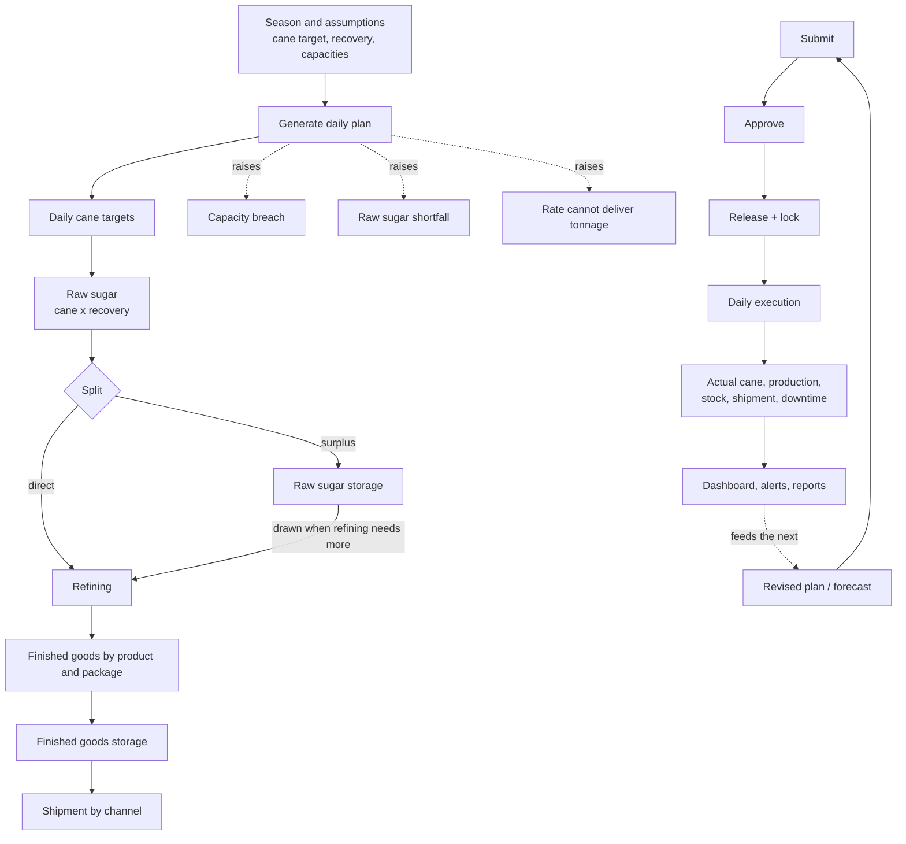
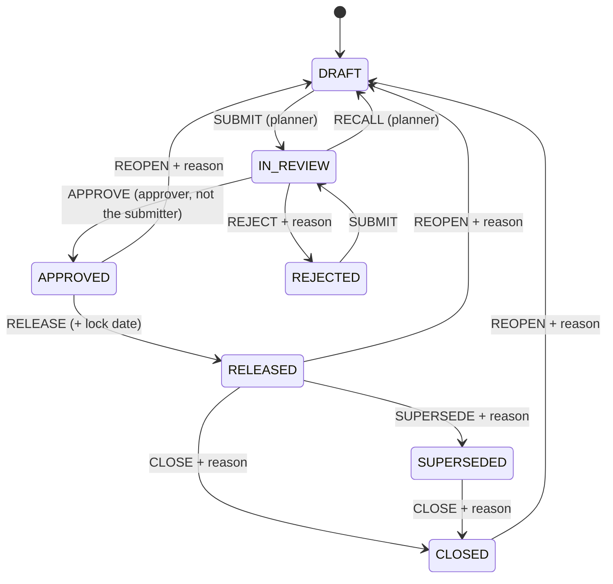
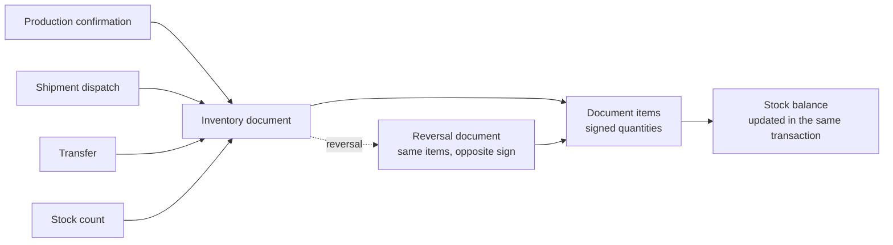

# 2. Business process map

From season plan to daily execution, inventory, shipment and reporting.

---

## 2.1 The chain in one picture

Everything above the workflow line is planning; everything below it is
execution. The two meet in the dashboard, which compares one against the other.

---

## 2.2 Planning: from a season target to 137 days of rows

The generator (`domain.Generate`) implements the chain the specification
describes in sections 5 to 9. Each step names the calculation that does it —
see [06-calculation-catalogue.md](06-calculation-catalogue.md).

**Step 1 — the calendar.** Working days are counted from the season start,
skipping any date marked non-working. If a maintenance window removes three
days, the campaign runs three days longer; the tonnage is not cut. This is a
deliberate choice (assumption Q4): a shutdown moves the end date, it does not
reduce what the factory has to crush.

**Step 2 — daily cane.** The season target is spread across the working days
with `AllocateEvenly` (C31), which rounds the running cumulative rather than
each day, so 137 days add back to exactly 2,300,000 t.

**Step 3 — raw sugar.** Each day's cane is multiplied by the recovery
assumption using `ScaleSeries` (C34), which preserves the season total exactly:
2,300,000 × 11.00 % = 253,000 t.

**Step 4 — the split.** The share configured as `RAW_DIRECT_TO_REFINE_PCT` goes
straight to the refinery, capped at what the refinery actually needs that day.
Anything the refinery still needs is drawn from raw storage — but never more
than the stock that exists. What is left over goes into storage. The split is
exhaustive: direct + to storage always equals the raw sugar produced.

**Step 5 — finished goods.** Each product mix entry is spread across the
campaign, either evenly or at its own daily rate. The rate form is how jumbo bag
packing is planned: 300 t/day until 20,700 t is reached, which is 69 working
days. If the rate cannot deliver the tonnage in the season, the generator says
so rather than quietly producing less.

**Step 6 — the ledgers.** Production becomes a receipt in the product's
warehouse; shipment at the quota rate becomes an issue, shared between products
in proportion to what was produced and never exceeding the stock on hand. Each
store's movements are rolled forward (C13–C16) so every stored row carries its
beginning and ending balance.

**Step 7 — the warnings.** Before the plan can be released the generator
reports what it found: which store crosses its warning and critical thresholds
and on what date, whether the raw sugar supply covers refining, and whether any
mix entry's rate is too low. In the reference scenario it finds three real
problems — see [01-assumptions-and-questions.md](01-assumptions-and-questions.md).

---

## 2.3 Approval: draft to released baseline

Three rules make this more than a status field:

1. **The submitter cannot approve.** Checked in the service, not the UI.
2. **Reason-bearing actions record the reason on the audit event.** Reject,
   supersede, close and reopen all require one.
3. **Reopening clears the approval trail.** Approved-by, approved-at, released-at
   and the lock date are all cleared, so a reopened plan has to earn its
   approval again. The history of what happened stays in the audit trail.

Releasing supersedes whatever was released before, so a season has exactly one
live baseline at any moment.

---

## 2.4 Execution: the daily cycle

The daily rhythm the system is built around:

| When | Who | What | Where |
| --- | --- | --- | --- |
| Through the day | Weighbridge / cane operator | Cane delivered, accepted, rejected, crushed | Planning board, Cane tab, series ACTUAL |
| End of each shift | Shift supervisor | Production by product, process loss, rework, hold | Planning board, Production tab |
| End of each shift | Shift supervisor / maintenance | Downtime events with reason and root cause | Downtime |
| Daily | Warehouse operator | Receipts, transfers, adjustments, physical counts | Planning board, Stock tab |
| Daily | Shipment planner | Dispatch by channel | Planning board, Shipments tab |
| Per sample | Laboratory | Quality results, holds and releases | Quality (phase 4) |
| Next morning | Everybody | Yesterday against plan, and what it does to the forecast | Executive overview |

Actuals are posted to the season's `ACTUAL` version. The plan is never touched
by an operator; the two series are compared, never merged.

**What the system does with an actual the moment it is posted:**

- The cumulative actual and the achievement percentage move (C1–C4).
- The rolling average moves, which moves the forecast completion date (C6, C7).
- If the forecast slips past the planned end date, a schedule alert appears,
  escalating to an error beyond a week.
- Recovery is recalculated and judged against the operating window (C11, C12).
- Stock balances roll forward from the changed day to the end of the season, so
  the capacity forecast and the required shipment rate move with it.

---

## 2.5 Inventory: documents, not edits

A balance is never typed. It is the consequence of movements, and a mistake is
corrected with a reversal that points back at the original. That is what makes
the ledger auditable and what lets a confirmation be undone without deleting
history.

The daily stock ledger the planner sees is the planning view of this: one row
per warehouse, product and day, carrying beginning balance, each movement type,
and ending balance. Continuity — every day's beginning balance equals the
previous day's ending balance — is asserted by tests at the domain, service and
store layers.

---

## 2.6 Capacity: the question the workbook could not answer

This is where the system earns its place against a spreadsheet. Given a plan,
it answers four questions that a wide worksheet cannot:

1. **When does this store fill?** Roll the ledger forward and find the first day
   the balance crosses the threshold (C17).
2. **What shipment rate would prevent it?** The smallest constant daily rate that
   keeps the balance inside the limit on *every* day of the horizon — which is
   not the average, because an early peak binds harder than a late one (C18).
3. **What rate clears this stock by a date?** (C19)
4. **What happens if we ship nothing?** The same calculation with the shipment
   set to zero, which is one scenario copy away.

In the reference plan the answers are uncomfortable and correct: FG-WH1 fills on
1 January 2027 and would need 844 t/day rather than the planned 500 t/day.

---

## 2.7 Reporting

Every report is built from the same stored daily rows the screens use, by one
server-side builder per report. Preview, CSV, Excel and PDF all come from that
builder, so a printed report and a screen cannot disagree.

Every export carries company, factory, season, plan version, the filters that
were applied, the generation timestamp and the user who generated it. Twelve
months later, a printout still says what it is.

---

## 2.8 Where the phases fit

| Process area | Status |
| --- | --- |
| Season planning, versions, approval | Built (phase 1–2) |
| Cane, raw sugar, finished goods, storage, shipment planning | Built (phase 2) |
| Dashboard, capacity forecasting, alerts, reports, exports | Built (phase 3) |
| Downtime recording and lost-tonnage impact | Built |
| Production orders, confirmations, inventory documents | Data model built; services phase 4 |
| Quality samples, results, holds | Data model built; services phase 4 |
| Packaging material requirement planning | Built |
| Costing | Phase 5 |
| Weighbridge, LIMS, MES, ERP integration | Phase 5; outbox table already in place |
