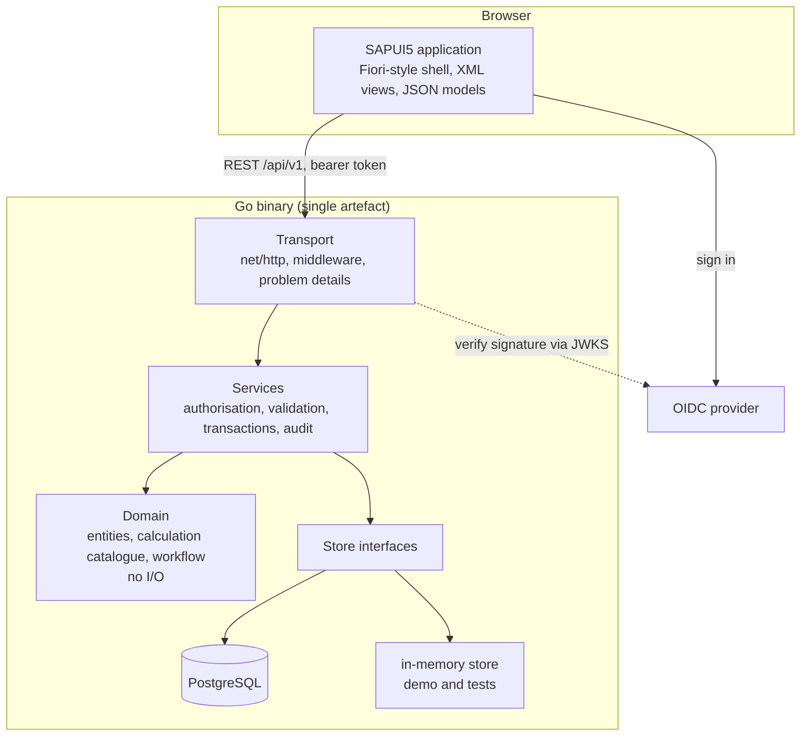
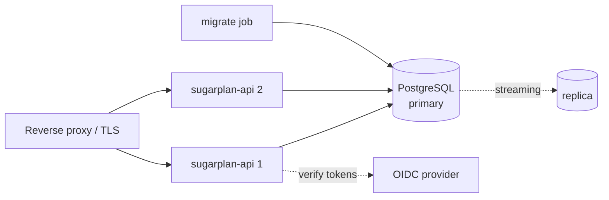

# 4. Architecture and repository structure

---

## 4.1 Shape

A modular monolith behind one HTTP surface, with the seams already cut where a
service would later be split out.



**The dependency rule.** Arrows point one way. The domain knows nothing about
HTTP, SQL or the clock; services know nothing about HTTP; the transport knows
nothing about SQL. Everything is injected through constructors, so nothing
reaches for a package-level variable.

### Layers

| Layer | Package | Responsibility | Never does |
| --- | --- | --- | --- |
| Domain | `internal/domain` | Entities, enumerations, the calculation catalogue, the plan generator, the workflow state machine | I/O of any kind; reads a clock it was not given |
| Store | `internal/store` + `memory`, `postgres` | Persistence, business keys, optimistic concurrency, transactions | Business rules |
| Service | `internal/service` | Authorisation, validation, orchestration across repositories, transaction boundaries, audit | SQL; HTTP |
| Transport | `internal/api` | Routing, decoding, problem details, ETags, idempotency, exports | Business rules |
| Support | `internal/auth`, `config`, `report`, `seed` | Token verification, configuration, renderers, demo data | — |

### Why two store implementations

`store.Store` has an in-memory implementation and a PostgreSQL one. This is not
a test double: both pass the same conformance suite
(`internal/store/storetest`), which asserts the same business keys, the same
optimistic concurrency, the same upsert semantics and the same transaction
rollback. The in-memory store backs the unit tests and the zero-infrastructure
demo profile; PostgreSQL is what a deployment runs.

The value is in the discipline: if a rule can only be expressed in SQL, it does
not belong in the store layer, it belongs in the domain.

---

## 4.2 Cross-cutting decisions

**Decimal everywhere.** Every quantity, rate and percentage is an exact decimal
end to end: `numeric` in PostgreSQL, `shopspring/decimal` in Go, a string or
JSON number on the wire. Binary floating point appears nowhere in a quantity
path.

**Transactions at the service boundary.** Anything that touches more than one
row goes through `store.InTx`: plan generation, bulk upserts, release, scenario
copy. The audit record is written inside the same transaction as the change it
describes, so the trail cannot describe something that was rolled back.

**Optimistic concurrency.** Every mutable row carries `row_version`. An update
is `WHERE id = $1 AND row_version = $2`; no rows affected means either the record
is gone (404) or somebody else changed it (412), and the store distinguishes the
two. Over HTTP this is an `ETag` and an `If-Match` header.

**Idempotency.** Posting endpoints accept an `Idempotency-Key`. The key is
claimed with an atomic `INSERT ... ON CONFLICT DO NOTHING`, so two concurrent
retries cannot both be treated as fresh.

**Errors.** Domain sentinel errors (`ErrValidation`, `ErrNotFound`,
`ErrConflict`, `ErrLocked`, …) map onto RFC 9457 problem documents in one place.
No SQLSTATE, constraint name or stack trace reaches a client; the correlation id
does, and the detail goes to the log.

**Observability.** One structured log line per request with correlation id,
user, status and duration. The correlation id flows into the audit trail, so a
support question about a number leads back to the request that produced it.

---

## 4.3 Repository structure

```
sugar-planning/
├── README.md
├── backend/
│   ├── go.mod
│   ├── cmd/
│   │   ├── server/main.go          # API + optional static SAPUI5 hosting
│   │   └── migrate/main.go         # up / down / status / seed
│   └── internal/
│       ├── domain/                 # entities, calculations, generator, workflow
│       │   ├── decimalx.go         # the numeric contract
│       │   ├── model.go            # entities and enumerations
│       │   ├── calc.go             # the calculation catalogue, C1-C34
│       │   ├── generator.go        # season plan generation
│       │   ├── workflow.go         # state machine, locking, permissions
│       │   └── errors.go           # sentinel errors, field errors
│       ├── store/
│       │   ├── store.go            # repository interfaces
│       │   ├── memory/             # in-memory implementation
│       │   ├── postgres/           # PostgreSQL implementation
│       │   │   └── migrations/     # versioned .up.sql / .down.sql (embedded)
│       │   └── storetest/          # conformance suite both must pass
│       ├── service/                # planning, generate, dailyrows, analytics,
│       │                           # materials, compare
│       ├── api/                    # router, handlers, middleware, problem
│       │                           # details, reports, openapi.yaml
│       ├── auth/                   # principal, roles, OIDC and dev verifiers
│       ├── config/                 # environment configuration + validation
│       ├── report/                 # CSV, XLSX and PDF writers
│       └── seed/                   # the reference scenario
├── frontend/
│   ├── package.json, ui5.yaml
│   └── webapp/
│       ├── index.html, manifest.json, Component.js
│       ├── controller/             # one per page + BaseController
│       ├── view/                   # XML views
│       ├── model/                  # SugarService, formatter, chart
│       ├── i18n/                   # en (source), km, th
│       └── css/style.css
├── database/README.md              # how to run the migrations
├── deploy/                         # Dockerfiles, compose, .env.example
└── docs/                           # this documentation set
```

Migrations live under `internal/store/postgres/migrations` because they are
embedded into the binary with `go:embed`. The image that serves the API is the
image that migrates the database, so the two can never be out of step.
`database/README.md` explains how to run them with `psql` instead.

---

## 4.4 Deployment



The API is stateless: sessions are bearer tokens verified against the provider's
keys, so any instance can serve any request and instances scale horizontally.
The only shared state is PostgreSQL.

Two deployment shapes are supported:

- **Single container.** `HTTP_STATIC_DIR` points at the built SAPUI5 files and
  one process serves both, which is the simplest on-premises install: one
  container plus a database.
- **Split.** A web server serves the frontend and proxies `/api` to the API
  containers, which is what a site with an existing reverse proxy will do.

Both are same-origin, so no CORS configuration is needed. `HTTP_ALLOWED_ORIGINS`
exists for the case where the frontend genuinely lives elsewhere, and is empty
by default.

**Start-up order.** Run the migrate job to completion, then start the API.
`DB_MIGRATE_ON_START` exists for development convenience; in production the
migration is a separate, observable step.

**Health.** `/healthz` is liveness — the process is up. `/readyz` is readiness —
the database answers. A rolling deployment should gate on `/readyz`.

---

## 4.5 Performance

The targets from section 23 are p95 under 500 ms for indexed list queries and
under 2 s for dashboards.

What the design does about it:

- **Composite indexes match the access pattern**: `(version_id, business_date)`,
  `(version_id, business_date, product_id)`, `(version_id, business_date,
  warehouse_id)`. Every daily-row query filters on version and date.
- **Balances are stored, not replayed.** Editing one day recalculates that store
  forward once, on write, rather than every read replaying 137 days.
- **Partial indexes** cover the "open records" queries: active master data, open
  production orders, unreleased quality holds, unpublished outbox events.
- **Paging is capped** at 1,000 rows for lists; daily-row queries are bounded by
  the date range, which the UI always sets.
- **The dashboard is one round trip.** It aggregates in Go from a handful of
  indexed queries rather than issuing a query per KPI.

Partitioning the high-volume tables by season is prepared for but not enabled;
see [05-data-model.md](05-data-model.md) for the trigger point.

---

## 4.6 Failure behaviour

| Failure | Behaviour |
| --- | --- |
| Database unreachable at start-up | The process exits with a clear message rather than serving errors |
| Database unreachable while running | `/readyz` fails, the load balancer removes the instance, requests get a 500 problem document with a correlation id |
| A posting fails part way | The transaction rolls back; nothing is written, including the audit record. Asserted by `TestTransactionRollback` |
| Two users edit the same record | The second gets 412 with the name of who changed it and both versions |
| A retried posting arrives twice | The idempotency key replays the first response |
| A panic in a handler | Recovered, logged with the stack, answered with a 500 problem document; the process stays up |
| A slow request | The context deadline (30 s default) cancels it rather than pinning a connection |
| Shutdown signal | Stops accepting, drains in-flight requests within the shutdown timeout, closes the pool |
