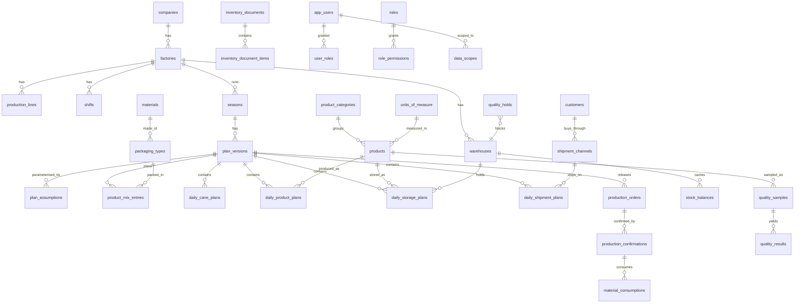

# 5. PostgreSQL data model and data dictionary

70 tables in ten migrations. The migrations under
`backend/internal/store/postgres/migrations` are the authority; this document
explains the shape and the reasoning.

---

## 5.1 The central idea: narrow daily facts, not a wide sheet

The workbook this system replaces is one very wide sheet: a column per measure
per channel per product, and a row per day. That shape is why adding a customer
means editing a formula in eighty places.

The replacement is four narrow tables, each keyed on
`(version, business date, its own dimensions, series)`:

| Table | One row is | Dimensions |
| --- | --- | --- |
| `daily_cane_plans` | a day of cane supply and crushing | factory, shift |
| `daily_product_plans` | a day of output for one product | factory, line, shift, product, packaging |
| `daily_storage_plans` | a day of stock movement for one product in one store | warehouse, product |
| `daily_shipment_plans` | a day of dispatch for one product on one channel | warehouse, product, channel |

Adding a trader is a row in `shipment_channels`. Adding a product is a row in
`products`. Neither touches the schema.

### Plan and actual never collide

Two mechanisms, deliberately overlapping:

1. **Different containers.** Actuals live in the season's `ACTUAL` plan version,
   created automatically with the season and unique per season
   (`plan_versions_one_actual`).
2. **Different series.** Every daily row carries `series` of `PLAN` or `ACTUAL`,
   and `series` is part of the natural key.

So a plan row and an actual row for the same date are different rows, and an
actual posting cannot overwrite an approved plan even if a defect let it try.

---

## 5.2 Entity relationships



---

## 5.3 Table groups

### Organisation and master data (migration 0001, 20 tables)

`companies`, `factories`, `production_areas`, `production_lines`, `stations`,
`shifts`, `work_calendar_days`, `product_categories`, `units_of_measure`,
`products`, `uom_conversions`, `packaging_types`, `warehouses`,
`storage_zones`, `customers`, `shipment_channels`, `materials`,
`packaging_bom`, `reason_codes`, `equipment`.

Every one carries the same envelope: a business `code` with a unique
constraint, `valid_from` / `valid_to` / `active` for effective dating, the four
audit columns and `row_version`.

### Planning (migration 0002, 9 tables)

`seasons`, `plan_versions`, `plan_assumptions`, `product_mix_entries`, the four
daily tables, `scenario_comparisons`.

### Execution (migration 0003, 9 tables)

`batches`, `production_orders`, `production_confirmations`,
`material_consumptions`, `inventory_documents`, `inventory_document_items`,
`stock_balances`, `stock_reservations`, `stock_counts`.

Inventory is document-based. `inventory_document_items.quantity` is signed — a
receipt positive, an issue negative — so a reversal is the same items with the
sign flipped, and `reversal_of` points at what was reversed. `stock_balances` is
a cache of that history maintained in the same transaction, never the source of
truth.

### Quality and downtime (migration 0004, 7 tables)

`quality_parameters`, `quality_specs`, `quality_samples`, `quality_results`,
`quality_holds`, `downtime_events`, `maintenance_windows`.

Specification limits are effective-dated: tightening a colour limit must not
retrospectively fail last season's batches.

### Security and governance (migration 0005, 16 tables)

`app_users`, `roles`, `permissions`, `role_permissions`, `user_roles`,
`data_scopes`, `approval_requests`, `approval_steps`, `comments`,
`audit_events`, `outbox_events`, `import_jobs`, `export_jobs`, `attachments`,
`notifications`, `idempotency_keys`.

`notifications.recipient` holds a **role code**, not a username - see migration
0010.

`app_users` holds **no password hash**. Identity is the provider's job; this
table holds the subject claim, the display name and what audit attribution
needs.

### Negative stock (migration 0006, no new tables)

Relaxes `stock_balances_hold_ck` to `hold_quantity <= GREATEST(quantity, 0)`.
The original constraint forbade a negative balance outright, which contradicted
the deliberate `AllowNegativeStock` override — a reversal has to be allowed to
drive a shed below zero rather than leave a wrong posting standing.

### Costing (migration 0007, 5 tables)

`cost_elements`, `cost_rates`, `exchange_rates`, `cost_runs`, `cost_run_lines`.

Rates are held apart from quantities because that is what makes a variance
decomposable: a cost that moved did so because the rate changed or because the
quantity did. Rates are effective dated, so a mid-season fuel price rise does not
rewrite the cost of the weeks before it. A saved run keeps the rates it used, so
the figure is reproducible after those rates have moved on.

### Imports (migration 0009, 2 tables)

`import_mappings`, `import_rows`, plus columns on `import_jobs`.

The mapping template is the thing a site gets right once: which column of which
shape of file holds which field, and how the dates and numbers in it are
written. Its columns are `jsonb` because that shape *is* the mapping - a list of
field-to-column pairs that varies per site and per file - and nothing joins to it
or queries inside it.

`import_rows` is the staging area. A file is never posted as it arrives: it is
read through its mapping into these rows, validated, shown to somebody, and
committed only when they say so. The rows are held rather than the file, because
a file on disk would need a storage layer, a retention policy and a backup of its
own, while the rows as they were parsed are what a preview shows, what an error
download lists and what a commit applies.

### Background jobs (migration 0008, 1 table)

`job_leases`.

The lease behind the in-process scheduler. Two application instances behind a
load balancer both have a scheduler and both wake at the same moment; the lease
is what stops them doing the same work twice. It is a plain row rather than a
PostgreSQL advisory lock deliberately: an advisory lock dies with its
connection, which is right for a lock and wrong for a record of when a job last
ran and what it said. `expires_at` is what makes a crash recoverable — an
instance that dies holding the lease blocks its job only until the lease runs
out.

### The inbox (migration 0010, no new tables)

Adds `factory_id` to `notifications`.

There is no user directory here: identity, roles and data scope all come from the
token the identity provider issued. So a notification is addressed to a **role at
a factory** - "the shipment planners at Kampong Speu" - and somebody's inbox is
what their roles and their scope entitle them to see. It is also the better
answer operationally: an alert addressed to a person who has left is an alert
nobody owns.

### Where this differs from the table list in section 17

Section 17 names table groups rather than a schema, and five of the names it
uses are modelled differently here. Each is a decision, not an omission.

| Named in section 17 | Here | Why |
| --- | --- | --- |
| `silos` | `warehouses.is_silo` | A silo *is* a store with a capacity and a stock balance. Two tables would need two ledgers, two capacity checks and two sets of alerts, and the first question anyone asks — "how much room is left" — would have two answers |
| `work_calendars` | `work_calendar_days` | A calendar is only ever read one day at a time. The row is the day |
| `users` | `app_users` | Named to make clear it is not an identity store: it holds the subject claim, the display name and what audit attribution needs, and no password hash |
| `stock_adjustments` | An `ADJUSTMENT` inventory document | Every stock movement goes through one posting engine, so an adjustment is reversed, audited and balanced by exactly the same code as a receipt. A separate table would be a second way to move stock, and the second way is the one that gets the rules wrong |
| `production_confirmation_items` | `material_consumptions` | The items of a confirmation *are* what it consumed. The name says which |

### Saved views (migration 0011, 1 table)

`saved_views`: a named set of filters, sorts and column choices for one screen.
Variant management, saved views and personalization are the same thing stored.

Two decisions worth recording.

The payload is `jsonb` and deliberately not modelled. What a view holds is a
property of the screen it belongs to — the planning board saves a date range and
a series, the order list saves a status filter — and a table with a column per
filter would need migrating every time a screen grew one. The server does not
interpret it; it stores what the page sent and hands it back, bounded at 16 KiB
so the endpoint cannot become arbitrary per-user storage.

A view belongs to the person who made it: `owner` is the username from the
token, not a foreign key, because identity lives in the identity provider.
Shared views exist because a factory that has worked out the right filter for a
morning review should not each rediscover it, but only the owner may change or
delete one — a variant anybody can edit is a variant nobody can rely on. Reading
somebody else's is not forbidden but *absent*: there is no operation that
reaches it, so a request for one is a 404, the same shape as an inbox addressed
to a role you do not hold.

`saved_views_default_idx` is a partial unique index over `(owner, page) WHERE
is_default`, which is what enforces "at most one default per person per page"
rather than application code two tabs could race. It is worth knowing that a
partial unique index cannot be deferred: the first implementation of
`SetDefault` cleared the old default and set the new one in the branches of a
single data-modifying CTE, and PostgreSQL refused it, because CTE branches see
one snapshot and run in an unspecified order. Clearing has to happen in its own
statement, before the set, inside the transaction.

---

## 5.4 Data dictionary: the tables that carry the numbers

### `seasons`

| Column | Type | Notes |
| --- | --- | --- |
| `id` | uuid PK | |
| `company_id`, `factory_id` | uuid FK | |
| `code` | text | Unique per factory. "2026-2027" |
| `start_date` | date | |
| `end_date` | date | Follows the generated campaign |
| `planned_days` | integer | Crushing days, not calendar days |
| `status` | text | `OPEN`, `CLOSED` |

### `plan_versions`

| Column | Type | Notes |
| --- | --- | --- |
| `id` | uuid PK | |
| `season_id` | uuid FK | |
| `version_no` | integer | Unique per season, assigned on insert |
| `code` | text | Unique per season |
| `plan_type` | text | `BUDGET`, `FORECAST`, `REVISED`, `WHATIF`, `BASELINE`, `ACTUAL`, `LATEST_ESTIMATE` |
| `status` | text | `DRAFT`, `IN_REVIEW`, `APPROVED`, `RELEASED`, `SUPERSEDED`, `REJECTED`, `CLOSED` |
| `source_version_id` | uuid FK, self | What this was copied from |
| `locked_through` | date | Dates up to this are read-only once released |
| `submitted_at`, `approved_at`, `approved_by`, `released_at` | | The approval trail; cleared on reopen |

Two partial unique indexes carry business rules the application must not be the
only guardian of:

```sql
CREATE UNIQUE INDEX plan_versions_one_released ON plan_versions (season_id)
    WHERE status = 'RELEASED';
CREATE UNIQUE INDEX plan_versions_one_actual ON plan_versions (season_id)
    WHERE plan_type = 'ACTUAL';
```

### `plan_assumptions`

The levers. Every rate, factor and threshold the calculations use lives here, so
no business number is a constant in the code.

| Column | Type | Notes |
| --- | --- | --- |
| `code` | text | `CANE_TARGET_TONS`, `RAW_RECOVERY_PCT`, `REMELT_INPUT_FACTOR`, … |
| `value` | numeric(18,6) | |
| `uom` | text | `TON`, `%`, `TON/DAY`, `RATIO` |
| `valid_from`, `valid_to` | date | Effective dating |

Business key `(version_id, code, COALESCE(valid_from, '0001-01-01'))`, so an
import can be re-run without duplicating a row.

### `daily_cane_plans`

| Column | Type | Notes |
| --- | --- | --- |
| `series` | text | `PLAN` or `ACTUAL` |
| `cane_available` … `cane_crushed` | numeric(18,3) | All non-negative, check-constrained |
| `crush_rate_tph` | numeric(12,3) | |
| `available_hrs`, `stoppage_hrs` | numeric(6,2) | Both 0–24 |
| `reason_code` | text FK | Why the day differed |

Natural key `(version_id, factory_id, business_date, COALESCE(shift_id, …), series)`.

### `daily_storage_plans`

| Column | Type | Notes |
| --- | --- | --- |
| `beginning_balance` | numeric(18,3) | Calculated (C13), stored |
| `production_receipt`, `transfer_in/out`, `repack_in/out`, `remelt_issue`, `shipment_qty`, `process_loss`, `hold_qty` | numeric(18,3) | Magnitudes, all `>= 0` |
| `adjustment` | numeric(18,3) | **Signed** — the one column that may be negative |
| `ending_balance` | numeric(18,3) | Calculated (C14), stored |
| `physical_balance` | numeric(18,3) NULL | A recorded count; drives reconciliation (C20) |

Balances are stored rather than derived on read. Editing one day recalculates
that store forward to the end of the season, once, on write.

### `audit_events`

| Column | Type | Notes |
| --- | --- | --- |
| `occurred_at`, `actor`, `action`, `entity`, `entity_id` | | |
| `before_state`, `after_state` | jsonb | |
| `reason` | text | Required for reject, close, supersede and reopen |
| `correlation_id` | text | Ties the record to the request that caused it |
| `source_ip` | text | |

Append-only, and not only by convention:

```sql
CREATE RULE audit_events_no_update AS ON UPDATE TO audit_events DO INSTEAD NOTHING;
CREATE RULE audit_events_no_delete AS ON DELETE TO audit_events DO INSTEAD NOTHING;
```

---

## 5.5 Numeric precision

| Kind | Type | Why |
| --- | --- | --- |
| Quantity (t, kg, pieces) | `numeric(18,3)` | Tonnes to the kilogram; 18 digits holds a decade of a large mill |
| Rate (t/h, t/day) | `numeric(12,3)` | |
| Percentage | `numeric(6,3)` / `numeric(12,3)` | Three decimals is enough for recovery |
| Conversion factor | `numeric(18,6)` | Six decimals for unit conversions |
| Hours | `numeric(6,2)` / `numeric(8,3)` | |

`numeric`, never `float8`. A recovery percentage that drifts in the seventh
decimal produces a mass balance that does not close, and somebody spends a
morning looking for sugar that was never missing.

---

## 5.6 Constraints that encode business rules

**Check constraints.** No negative capacity, no negative quantity except
`adjustment`, `usable_pct` in (0, 100], hours in [0, 24], `end_date >=
start_date`, every enumeration restricted to its known values.

**Unique business keys.** A code per company; a version code per season; one
daily row per natural key. Where a key includes a nullable column, a
`COALESCE(col, '00000000-…')` unique index is used, because `NULL` is not equal
to `NULL` in a plain unique constraint and duplicates would slip through.

**Foreign keys** on every reference. Master data is deactivated, never deleted,
so no `ON DELETE CASCADE` on a master record. The cascades that do exist are
from a plan version down to its own rows, where deleting the parent genuinely
means deleting the children.

**Partial indexes** for the "open records" queries:

```sql
CREATE INDEX factories_company_idx ON factories (company_id) WHERE active;
CREATE INDEX production_orders_open_idx ON production_orders (factory_id, business_date)
    WHERE status IN ('PLANNED','RELEASED','IN_PROCESS','PARTIALLY_CONFIRMED');
CREATE INDEX quality_holds_open_idx ON quality_holds (warehouse_id, product_id)
    WHERE released_on IS NULL;
CREATE INDEX outbox_events_unpublished_idx ON outbox_events (created_at)
    WHERE published_at IS NULL;
```

**Composite indexes** aligned to how the application actually queries:
`(version_id, business_date)`, `(version_id, business_date, product_id)`,
`(version_id, business_date, warehouse_id)`, `(version_id, business_date,
channel_id)`.

---

## 5.7 Partitioning

Section 17 asks for partitioning of high-volume tables "when justified". It is
**not enabled**, and the reasoning is worth stating.

The volume: a factory produces roughly 137 cane rows, ~400 product rows, ~800
storage rows and ~400 shipment rows per season per version. With ten versions a
season and ten years of history, `daily_storage_plans` reaches on the order of
80,000 rows per factory. That is small. Partitioning would add operational
complexity for no measurable gain.

`audit_events` is the table that will grow: every posting, every workflow action,
every master data change. At a few hundred thousand rows a season it is still
comfortable, but it is the first candidate.

**The trigger point:** partition `audit_events` by month, and the daily tables by
season, when `audit_events` passes roughly 50 million rows or when the p95 of an
audit query exceeds 500 ms. The natural keys already include the partition key
(`business_date` on the daily tables), so the change is a migration rather than a
redesign.

---

## 5.8 Migrations

Five up scripts and five matching down scripts, applied in order, each in its own
transaction together with the row that records it, so an interrupted upgrade
leaves the database on a known version.

```
0001_core                 organisation and master data
0002_planning             seasons, versions, assumptions, daily facts
0003_execution            orders, confirmations, inventory documents
0004_quality_downtime     specs, samples, holds, downtime, maintenance
0005_security_governance  identity, approvals, audit, outbox, jobs
```

`LoadMigrations` refuses to start if any migration lacks a down script: "we
forgot" is not one of the technically-unsafe cases the specification exempts.

Verified in this environment against PostgreSQL 16.13: all five apply, all five
reverse to zero tables, and re-apply cleanly.

---

## 5.9 Row-level security

Available as a second line of defence for strict company or factory segregation.
It is not enabled by default: service-layer authorisation is mandatory and is
what the tests assert, and enabling RLS without also having the service checks
would move the security boundary somewhere the tests do not reach.

Where a site requires it, the policy shape is:

```sql
ALTER TABLE seasons ENABLE ROW LEVEL SECURITY;
CREATE POLICY seasons_by_factory ON seasons
    USING (factory_id = ANY (string_to_array(current_setting('app.factories', true), ',')::uuid[]));
```

with the API setting `app.factories` per connection from the principal's scope.
