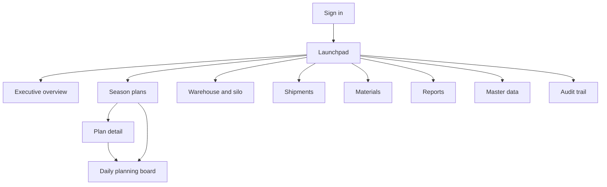

# 8. SAPUI5 sitemap, page specifications and wireframes

The application is an original Fiori-style design. It borrows the interaction
patterns the specification names — list report, object page, filter bar,
semantic colouring — and copies no SAP screen, layout or code.

---

## 8.1 Sitemap



Routes are hash-based and deep-linkable: `#/plans/{versionId}` opens a plan,
`#/board/{versionId}` opens its board.

### The shell

A tool header carrying the application name, the **season selector** and the
user menu; a side navigation for the areas; a page container.

The season selector is the application's context. Changing it raises one event
and every open page reloads against the new season — which is also how pages
recover when they were mounted before sign-in finished.

---

## 8.2 Pages

### Sign in

Selects a development account and signs in. In an OIDC deployment the list is
empty and the button redirects to the identity provider; nothing else changes.

### Launchpad

Five KPI tiles answering "is the season on track today" — cane crushed,
achievement, recovery, forecast completion, open alerts — above eight
navigation tiles. Each KPI tile is coloured by the same semantic rules used
everywhere else and drills into the overview.

### Executive overview

```
┌──────────────────────────────────────────────────────────────────┐
│ Executive overview                    Plan version [V1  ▾]   ⟳   │
├──────────────────────────────────────────────────────────────────┤
│ Exceptions                                            2 open     │
│  ⊗ Refined/White Warehouse 1 runs out of space     Jan 01, 2027  │
│  ⊗ Refined/White Warehouse 3 runs out of space     Feb 23, 2027  │
├──────────────────────────────────────────────────────────────────┤
│ Cane crushed    │ Cane remaining │ Forecast compl. │ Recovery     │
│ 226,474 t       │ 2,073,526 t    │ Apr 15, 2027    │ 10.89 %      │
│ of 235,036 t    │ at 17,100 t/day│ planned Apr 16  │ target 11.00 │
│ ▓▓▓▓▓▓▓░ 96.4 % │                │ 1 day early     │              │
├──────────────────────────────────────────────────────────────────┤
│ Cumulative cane, target against actual                           │
│   2.30 Mt ┤                                    ╱ ─ ─ ─ ─         │
│   1.15 Mt ┤                      ╱ ─ ─                           │
│        0 ┤━━━●                                                   │
│           2026-12-01        2027-02-07        2027-04-16         │
│           ─ ─ target    ── actual                                │
├──────────────────────────────────────────────────────────────────┤
│ Storage capacity                                                 │
│ Warehouse   Capacity  Usable   Closing   Use      First full     │
│ FG-WH1        22,000  22,000    97,090  441.3 %   Jan 01, 2027   │
├──────────────────────────────────────────────────────────────────┤
│ Finished goods by product     │  Shipment by channel             │
└──────────────────────────────────────────────────────────────────┘
```

**Exceptions come first.** A dashboard that leads with green numbers and buries
the problem is decoration. Alerts sort worst-first.

The chart is inline SVG generated in the browser. A charting library would be a
large dependency for two line charts, and an on-premises install has to serve
every asset itself. The actual line stops at the last recorded day rather than
running flat to April.

### Season plans

A list report over the season's versions: code, type, status, owner, lock date,
approver. Two actions in the header: **compare versions** and **new scenario**.

The scenario dialog is the what-if entry point: pick a source, give the copy a
code, optionally override the recovery assumption, and choose whether to carry
the daily rows across. The comparison dialog leads with *which assumptions
differ*, because that is usually the explanation for the tonnage difference
underneath it.

### Plan detail

An object page: workflow actions, assumptions, product mix, and what the last
generate run found.

- **Workflow actions** are rendered from `allowedActions`, which the server
  computes from the status, the plan type *and* the caller's permissions. A
  button the backend would refuse is never drawn.
- **Assumptions** are editable in place and save on change, because a planner
  adjusting a rate expects the next generate to use it.
- **Generate** warns first (it replaces the daily rows), then reports the
  summary and the warnings — capacity breaches, supply shortfalls, rates that
  cannot deliver.

### Daily planning board

This is the screen that replaces the 86-column worksheet.

```
┌────────────────────────────────────────────────────────────────────────┐
│ ‹ Daily planning board                                    V1  [Draft]  │
│ [Cane][Production][Stock][Shipments]  From … To …  Series [Plan ▾]     │
│                                       ● Unsaved changes  [Save][Discard]│
├────────────────────────────────────────────────────────────────────────┤
│ Date        Delivered  Accepted  Rejected  Crushed   Rate  Stop  Util. │
│ Dec 01,2026 [16788.32][16788.32][      0][16788.32][ 700][  0] 100.00 %│
│ Dec 02,2026 [16788.32][16788.32][      0][16788.32][ 700][  0] 100.00 %│
└────────────────────────────────────────────────────────────────────────┘
```

Instead of one wide sheet: **one process at a time**, one date range at a time,
with the series chosen explicitly.

| Requirement | How |
| --- | --- |
| Editable versus calculated | Editable cells are input fields; calculated ones (utilisation, balances) are plain text. The difference is visible without reading a header |
| Mass entry | Every cell in the range is editable; only changed rows are sent |
| Unsaved-change protection | A dirty indicator, a guard on navigation and tab switching, and a `beforeunload` handler |
| Validation | Non-numeric and negative values are caught in the field; everything else is caught by the server and the offending row is highlighted |
| All-or-nothing saves | A planner fixes one cell rather than discovering later that half the week saved |
| Read-only states | When the version is released and locked, or the series is wrong for the version, or the caller lacks the permission, the board says which and disables the inputs |
| Sticky headers | Column headers stay put while scrolling a fortnight |

### Warehouse and silo

The capacity table for every store — capacity, usable, closing stock, use
percentage, first warning date, first full date, and the shipment rate that
would prevent it. Selecting a store draws its balance against the capacity lines
and lists the daily ledger.

### Shipments

Planned against actual by channel, plus what the finished goods stores require:
the smallest constant daily rate that keeps each inside its threshold.

### Materials

The packaging requirement from the plan: gross requirement, safety stock,
available, on order, shortage, purchase requirement, required-by and order-by
dates. The formula is on the screen, because a buyer asked to place a large
order will want to see it.

### Reports

A master-detail: the catalogue on the left, parameters and preview on the right,
with Excel, CSV and PDF buttons. Preview and export come from the same
server-side builder, so they cannot disagree.

### Master data

One generic screen for all fourteen entities. Because every master entity has
the same API shape, the table is built from a column list per entity and a new
entity needs no new page.

### Audit trail

Filterable by entity and action, showing when, what, who, why and the
correlation id. Users without `audit:read` see an explanation instead of an
empty table.

---

## 8.3 UX rules applied throughout

**Semantic colour means one thing.** Error is red, warning orange, success
green, information blue, everywhere, driven by shared formatters. Note that
`sap.m.ValueColor` (Good/Critical/Error/Neutral) and `sap.ui.core.ValueState`
(Success/Warning/Error/Information) are different enumerations; each has its own
formatter, because mixing them throws at render time.

**Every KPI drills down.** A tile opens the overview; a warehouse row opens its
ledger; a report row opens the transactions behind it.

**Business-friendly display, exact storage.** Dates render in the user's locale
and are stored as ISO. Quantities render with thousands separators and are
stored as exact decimals. Formatters are display-only; a formatted value is
never fed back into a calculation.

**Errors name the field.** The problem document's `errors[]` array carries the
row and the field, and the error dialog renders them as "Row 2, caneCrushed:
…" rather than "invalid input".

**Responsive.** The side navigation collapses on a phone; tables use
`demandPopin` to fold secondary columns on narrow screens; the content density
is compact on a desktop and cozy on a touch device.

**Accessible.** Semantic controls throughout, so roles and labels come for free.
Every input has a `Label` with `labelFor`; the chart carries a text alternative
describing what it shows; colour is never the only signal — a state always has
text or an icon beside it.

---

## 8.4 Internationalisation

English is the source language in `i18n/i18n.properties`; every user-visible
string is there. `i18n_km.properties` and `i18n_th.properties` carry the same
keys, and a key that is absent falls back to English, so an untranslated string
appears in English rather than as a raw key.

The Khmer and Thai files are seeded with the shell and navigation — what an
operator meets first — and are structurally complete rather than fully
translated. Adding a language is a properties file and one entry in
`supportedLocales`.

One caveat, recorded as open question Q9: the PDF writer uses the standard
Helvetica fonts, which cannot render Khmer or Thai. Screen and Excel output are
fine; PDF needs an embedded font when the business confirms it is required.

---

## 8.5 Verification

The application was driven end to end in Chromium against the real API during
development:

- Sign in, and the season list loading into the shell
- Every navigation target rendering with live data and no console errors
- The dashboard's KPIs, alerts, chart and storage table matching the API
- The planning board: 84 editable cells over a fortnight, a value edited, the
  dirty indicator appearing, the save persisting (verified by re-reading through
  the API), the row version incrementing and an audit record being written
- A negative value flagged in the field before it reaches the server
- Master data, reports, materials and shipments rendering their real data
- The audit trail correctly refusing a planner, who lacks `audit:read`
