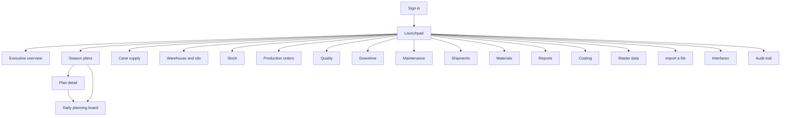

# 8. SAPUI5 sitemap, page specifications and wireframes

The application is an original Fiori-style design. It borrows the interaction
patterns the specification names — list report, object page, filter bar,
semantic colouring — and copies no SAP screen, layout or code.

---

## 8.1 Sitemap



Routes are hash-based and deep-linkable: `#/plans/{versionId}` opens a plan,
`#/board/{versionId}` opens its board.

### The shell

A tool header carrying the application name, the **season selector** and the
user menu; a side navigation for the areas; a page container.

The season selector is the application's context. Changing it raises one event
and every open page reloads against the new season — which is also how pages
recover when they were mounted before sign-in finished.

---

## 8.2 Pages

### Sign in

Selects a development account and signs in. The account list is fetched from the
server rather than kept in the browser, so an account added to the configuration
and forgotten in the page cannot happen — which it once did: the quality user was
configured on the server and missing from the page, and the laboratory role could
not be demonstrated at all. In an OIDC deployment the list comes back empty and
the button redirects to the identity provider; nothing else changes.

### Launchpad

Five KPI tiles answering "is the season on track today" — cane crushed,
achievement, recovery, forecast completion, open alerts — above twelve
navigation tiles. Each KPI tile is coloured by the same semantic rules used
everywhere else and drills into the overview.

### Executive overview

```
┌──────────────────────────────────────────────────────────────────┐
│ Executive overview                    Plan version [V1  ▾]   ⟳   │
├──────────────────────────────────────────────────────────────────┤
│ Exceptions                                            2 open     │
│  ⊗ Refined/White Warehouse 1 runs out of space     Jan 01, 2027  │
│  ⊗ Refined/White Warehouse 3 runs out of space     Feb 23, 2027  │
├──────────────────────────────────────────────────────────────────┤
│ Cane crushed    │ Cane remaining │ Forecast compl. │ Recovery     │
│ 226,474 t       │ 2,073,526 t    │ Apr 15, 2027    │ 10.89 %      │
│ of 235,036 t    │ at 17,100 t/day│ planned Apr 16  │ target 11.00 │
│ ▓▓▓▓▓▓▓░ 96.4 % │                │ 1 day early     │              │
├──────────────────────────────────────────────────────────────────┤
│ Cumulative cane, target against actual                           │
│   2.30 Mt ┤                                    ╱ ─ ─ ─ ─         │
│   1.15 Mt ┤                      ╱ ─ ─                           │
│        0 ┤━━━●                                                   │
│           2026-12-01        2027-02-07        2027-04-16         │
│           ─ ─ target    ── actual                                │
├──────────────────────────────────────────────────────────────────┤
│ Storage capacity                                                 │
│ Warehouse   Capacity  Usable   Closing   Use      First full     │
│ FG-WH1        22,000  22,000    97,090  441.3 %   Jan 01, 2027   │
├──────────────────────────────────────────────────────────────────┤
│ Finished goods by product     │  Shipment by channel             │
└──────────────────────────────────────────────────────────────────┘
```

**Exceptions come first.** A dashboard that leads with green numbers and buries
the problem is decoration. Alerts sort worst-first.

The chart is inline SVG generated in the browser. A charting library would be a
large dependency for two line charts, and an on-premises install has to serve
every asset itself. The actual line stops at the last recorded day rather than
running flat to April.

### Season plans

A list report over the season's versions: code, type, status, owner, lock date,
approver. Two actions in the header: **compare versions** and **new scenario**.

The scenario dialog is the what-if entry point: pick a source, give the copy a
code, optionally override the recovery assumption, and choose whether to carry
the daily rows across. The comparison dialog leads with *which assumptions
differ*, because that is usually the explanation for the tonnage difference
underneath it.

### Plan detail

An object page: workflow actions, assumptions, product mix, and what the last
generate run found.

- **Workflow actions** are rendered from `allowedActions`, which the server
  computes from the status, the plan type *and* the caller's permissions. A
  button the backend would refuse is never drawn.
- **Assumptions** are editable in place and save on change, because a planner
  adjusting a rate expects the next generate to use it.
- **Generate** warns first (it replaces the daily rows), then reports the
  summary and the warnings — capacity breaches, supply shortfalls, rates that
  cannot deliver.

### Daily planning board

This is the screen that replaces the 86-column worksheet.

```
┌────────────────────────────────────────────────────────────────────────┐
│ ‹ Daily planning board                                    V1  [Draft]  │
│ [Cane][Production][Stock][Shipments]  From … To …  Series [Plan ▾]     │
│                                       ● Unsaved changes  [Save][Discard]│
├────────────────────────────────────────────────────────────────────────┤
│ Date        Delivered  Accepted  Rejected  Crushed   Rate  Stop  Util. │
│ Dec 01,2026 [16788.32][16788.32][      0][16788.32][ 700][  0] 100.00 %│
│ Dec 02,2026 [16788.32][16788.32][      0][16788.32][ 700][  0] 100.00 %│
└────────────────────────────────────────────────────────────────────────┘
```

Instead of one wide sheet: **one process at a time**, one date range at a time,
with the series chosen explicitly.

| Requirement | How |
| --- | --- |
| Editable versus calculated | Editable cells are input fields; calculated ones (utilisation, balances) are plain text. The difference is visible without reading a header |
| Mass entry | Every cell in the range is editable; only changed rows are sent |
| Unsaved-change protection | A dirty indicator, a guard on navigation and tab switching, and a `beforeunload` handler |
| Validation | Non-numeric and negative values are caught in the field; everything else is caught by the server and the offending row is highlighted |
| All-or-nothing saves | A planner fixes one cell rather than discovering later that half the week saved |
| Read-only states | When the version is released and locked, or the series is wrong for the version, or the caller lacks the permission, the board says which and disables the inputs |
| Sticky headers | Column headers stay put while scrolling a fortnight |

### Warehouse and silo

The capacity table for every store — capacity, usable, closing stock, use
percentage, first warning date, first full date, and the shipment rate that
would prevent it. Selecting a store draws its balance against the capacity lines
and lists the daily ledger.

### Stock

The warehouse keeper's page. The current position first — on hand, on hold,
available, capacity and utilisation per store and product — and the movements
that produced it below, because a keeper wants to know what is in the shed before
they want to know how it got there.

**Post a movement** opens one dialog for every movement type. The quantity is
entered as a positive number and the movement type decides the sign; the
receiving store appears only for a transfer. A refused posting leaves the dialog
open with the offending line named, so the keeper corrects it rather than typing
the whole movement again.

**Reverse** posts the counter-document. Nothing is deleted and nothing is edited:
both documents stay in the ledger, which is what lets somebody six months later
see that a mistake was made and what was done about it.

### Production orders

What the floor has been told to make, and what it actually made. **Create from
plan** raises orders for a range of days from the released plan and reports both
numbers — created and already covered — because "nothing created" is a normal
answer when the range is already done. The button is disabled when the season has
no released plan, and the message strip says why.

Selecting an order opens its detail: quantities, variance, its confirmations, and
the actions its status allows. The buttons follow `allowedActions` from the API,
so a button that would be refused is disabled rather than offered and then
rejected.

**Confirm** offers the open quantity as the default, so a shift that made what it
was asked to make presses one button. Only the yield is receipted into the chosen
store; scrap and rework are recorded but not.

### Quality

The laboratory. Samples above, holds on stock below.

Selecting an open sample opens the laboratory sheet with one row per configured
parameter. A parameter left blank was not measured and is not sent — an empty box
is not a reading of zero. The sheet is judged server-side and the verdict comes
back with it; a parameter with no limits in force is reported separately, because
an unspecified parameter is a configuration gap rather than a quality event.

A failed sheet blocks the quantity named on it. The holds table shows what is
blocking and what has been released; releasing needs the quality release
permission, which the keeper does not hold.

A completed sample carries a **Certificate** button that downloads the
certificate of analysis as a PDF — the document that goes in the envelope with a
consignment. It appears only once the sample is complete: a certificate is read
as a guarantee, and an unfinished sheet is not one the laboratory has given yet.

### Downtime

The stoppage log: what actually stopped, when, why, and what it cost. Filters by
date range and line; the ranking of reasons by hours lost sits above the list and
describes the filtered rows, so narrowing to one line answers "what stops this
line" rather than repeating the season figure.

It is separate from the maintenance calendar on purpose. A maintenance window is
a decision taken in advance that shortens the crushing season; a stoppage is a
record of what happened, entered after the fact by the shift that lived through
it. Mixing them would mean an unplanned boiler failure could quietly move the end
of the campaign.

Recording one asks for the two clock times rather than a duration, because a
duration typed in beside two times is a third figure that can disagree with them;
the server derives it from whole minutes. An end time earlier than the start is
read as the next morning, so a night-shift stoppage is entered on the day the
shift began. The reason must be one of the `DOWNTIME` reason codes — the list
offered holds only those, and the server refuses anything else, because a reason
nobody can name becomes a bucket of one in the ranking.

### Maintenance

The outage calendar, with a standing warning at the top: an approved,
factory-wide window removes crushing days, and the season is extended rather than
shortened, so the campaign ends later. Approving asks for confirmation and says
how many days it will cost. Leaving the line unset means the whole factory stops,
which is the case that moves the end of the season; a line outage does not.

### Shipments

Planned against actual by channel, plus what the finished goods stores require:
the smallest constant daily rate that keeps each inside its threshold.

### Cane supply

Where the season's cane comes from, and whether it can actually get to the gate.

Three parts, top to bottom. **Season coverage** is six figures: the cane target,
what the sources have committed, coverage as a percentage, the difference, what
the land should yield and how many sources are behind it. Then the warnings the
reconciliation raised — a shortfall in red, a surplus in amber, a source
committed to more than its land grows or more than its lorries can move.

The **commitments** table is one row per source: area, expected yield, what it
has committed, its harvest window, and the pair that decides whether the promise
is keepable — the tonnage it must move each day against the tonnage its lorries
carry. Those two sit next to each other and the second changes colour, because
that comparison is the reason a planner opens this page.

At the bottom, the **delivery schedule** the commitments generate, drawn as one
bar a day with what actually arrived at the gate on top of it. The two series
are summed across sources rather than shown per source: the queue at the
weighbridge is one queue, and a day where one zone over-delivers while another
fails is still a day the mill was short.

Building the schedule asks first. It overwrites the planned rows, and a planner
who has hand-adjusted a week of deliveries would lose that work.

### Materials

The packaging requirement from the plan: gross requirement, safety stock,
available, on order, shortage, purchase requirement, required-by and order-by
dates. The formula is on the screen, because a buyer asked to place a large
order will want to see it.

### Reports

A master-detail: the catalogue on the left, parameters and preview on the right,
with Excel, CSV and PDF buttons. Preview and export come from the same
server-side builder, so they cannot disagree.

### Master data

One generic screen for all fifteen entities. Because every master entity has
the same API shape, the table is built from a column list per entity and a new
entity needs no new page.

### Import a file

Three steps, deliberately not one button: choose the mapping, the plan version
and whether the file holds plan or actual figures; upload; then look at what
would be written before committing it.

The preview is the screen. Each row shows the line number *in the uploaded
spreadsheet* — because fixing an import means going to those lines — what will
happen to it (new, replaces, refused), the values as they were parsed, and the
problem if there is one. Two message strips carry what did not line up: columns
the mapping ignores, and mapped columns the file lacks. Those two are the first
thing to check when an import produced nothing.

The version list is narrowed by the series, so a plan file cannot be pointed at
the actuals container or the other way round: that is a mistake worth making
impossible rather than validating. Refused rows download as a CSV to open beside
the original.

### The inbox

A bell in the shell header with the unread count, opening a dialog rather than a
page: an inbox is read in the middle of doing something else, and navigating away
from a half-finished screen to look at it would be the wrong trade.

Unread items carry the weight; read ones stay, dimmed, because the inbox is an
account of what happened rather than a queue that empties.

### Interfaces

What this system has told the connected systems, and what it has not managed to
tell them yet. Three tiles — waiting, given up, delivered — and the outbox
below, filterable by topic.

The **given up** tile is the one that matters and the easiest to leave off a
screen: those events stopped being retried after twenty-five attempts and are
waiting for a person. They are not lost, and a red strip says so in words rather
than leaving somebody to work it out from a count. **Send now** drains what is
due, which is what somebody does after an outage rather than waiting for the next
tick; **Retry** on a single row delivers it whatever its backoff says, which is
what they do once the far end is fixed.

Behind `integration:read`, which an administrator and an auditor hold. A retry
that still fails shows the far end's own words, because that is what the operator
pressed the button to find out.

### Audit trail

Filterable by entity and action, showing when, what, who, why and the
correlation id. Users without `audit:read` see an explanation instead of an
empty table.

---

## 8.3 UX rules applied throughout

**Semantic colour means one thing.** Error is red, warning orange, success
green, information blue, everywhere, driven by shared formatters. Note that there are three
overlapping enumerations, not two: `sap.ui.core.ValueState`
(Success/Warning/Error/Information) for ObjectStatus and ProgressIndicator,
`sap.m.ValueColor` (Good/Critical/Error/Neutral) for NumericContent and the
micro charts, and `sap.ui.core.IconColor`
(Positive/Critical/Negative/Neutral) for `sap.ui.core.Icon`. Passing one where
another is expected drops the colour, so each has its own formatter and a unit
test that stops the three being consolidated into one.

**Every KPI drills down to the daily rows behind it.** A figure nobody can get
behind is a figure nobody can check, so each headline carries a link to the
transactions it is a sum of, and the window travels with it: a tile describing
December opens on December rather than on the season's first fortnight.

| KPI | Opens |
| --- | --- |
| Cane crushed, remaining, forecast completion | The board's cane rows, actual series, the fortnight to the as-of date |
| Raw sugar recovery | The board's production rows for the same fortnight |
| A warehouse row | That store's daily ledger, with its balance drawn against the capacity lines |
| A shipment channel | The board's daily dispatch rows — not the shipments summary, because drilling from a total to a total is not drilling down |
| Downtime | The stoppage log for the same period |

A target that does not exist says so rather than doing nothing, because a link
that silently fails reads as broken rather than as absent.

**Sorting and grouping on the list screens.** The downtime log, the order list
and the laboratory samples each offer a sort and group dialog, over the fields
that make sense to sort or group by. Only some fields are groupable: grouping a
list by a date or a tonnage produces one group per row, which is a longer list
than the one it replaced. Where a group key is an identifier — a line, a
product — the readable name is resolved onto the row first, because a group
header showing a uuid is worse than no grouping.

The daily planning board is deliberately excluded. A ledger is read in date
order: the beginning balance of one row is the ending balance of the row above
it, and a grid sorted by tonnage would show a column of continuity errors that
are not there. That absence is the design, not a gap.

**Saved views on every screen with filters.** Variant management, saved views
and personalization are the same thing stored: what a page looked like when
somebody had it the way they wanted, under a name they can find again. The bar
sits in the filter toolbar and works the same everywhere, because the behaviour
is in the base controller rather than in each page.

A view belongs to whoever made it. Sharing offers it to everyone at the same
factory, and only the owner may change or delete one — the Delete and Default
buttons are hidden rather than disabled on a colleague's variant, since a
greyed-out button invites a click that will only ever be refused. A "Changed"
marker appears when the screen no longer matches the view it was set from, and
it means exactly that: a page that re-applies the same filter has not modified
anything, and a marker that cried wolf would be ignored.

A default view is applied once per page visit, not on every refresh — a planner
who has narrowed the dates and then pressed refresh means "show me that again",
not "throw away what I just set up". A page arrived at through a drill-down
keeps the filter that was clicked, because somebody who clicked through to a
period meant that period.

A view stores the sort order as well as the filter, because the order is part of
how somebody has the screen set up and a view that restored only half of it
would come back half applied.

The version is deliberately not part of what a board view stores: a filter that
named a plan version would stop working the day that version was superseded.

**Business-friendly display, exact storage.** Dates render in the user's locale
and are stored as ISO. Quantities render with thousands separators and are
stored as exact decimals. Formatters are display-only; a formatted value is
never fed back into a calculation.

**Errors name the field.** The problem document's `errors[]` array carries the
row and the field, and the error dialog renders them as "Row 2, caneCrushed:
…" rather than "invalid input".

**Responsive.** The side navigation collapses on a phone; tables use
`demandPopin` to fold secondary columns on narrow screens; the content density
is compact on a desktop and cozy on a touch device.

**Accessible.** Semantic controls throughout, so roles and labels come for free.
Every input has a `Label` with `labelFor`; the chart carries a text alternative
describing what it shows; colour is never the only signal — a state always has
text or an icon beside it.

---

## 8.4 Internationalisation

English is the source language in `i18n/i18n.properties`; every user-visible
string is there. `i18n_km.properties` and `i18n_th.properties` carry **the same
626 keys** — Khmer and Thai are complete, not seeded, and the manifest declares
both as supported locales. Adding a language is a properties file and one entry
in `supportedLocales`.

**Why the tests check both directions.** They did not, and that is how this was
missed. CI checked that a translation carried no key the English source lacked —
an orphan, which is dead weight — and never checked the reverse. Khmer and Thai
sat at 95 of 580 keys while both were advertised as supported, so switching
language gave a screen four-fifths in English. The fallback working is precisely
what stopped anyone noticing.

`frontend/test/i18n.test.js` now holds every bundle to the source on:

| | Why it matters |
| --- | --- |
| Every English key is translated | A missing one is an English sentence in the middle of a Khmer screen |
| No key the source lacks | Dead weight, and usually a typo of a real key |
| No duplicate keys | The later one silently wins |
| Placeholders `{0}`, `{1}` survive | A dropped one loses an argument out of the middle of a sentence |
| `\n` escapes survive | A lost one puts a literal backslash-n on screen |
| No empty values | An empty label is worse than falling back to English |
| The manifest matches the bundles | A locale with no bundle serves English under a language name |

**The vocabulary needs a native review.** The industry terms follow mill usage —
អំពៅ / อ้อย for cane, ស្ករឆៅ / น้ำตาลทรายดิบ for raw sugar, អត្រាទាញយកស្ករ /
ประสิทธิภาพการหีบสกัด for recovery — but a mill has its own house words, and
those are worth going through with the people who will read these screens every
morning. The structure is guaranteed by the tests; the word choice is not
something a test can check.

One caveat, recorded as open question Q9: the PDF writer uses the standard
Helvetica fonts, which cannot render Khmer or Thai. Screen and Excel output are
fine; PDF needs an embedded font when the business confirms it is required.

---

## 8.5 Verification

The application was driven end to end in Chromium against the real API during
development:

- Sign in, and the season list loading into the shell
- Every navigation target rendering with live data and no console errors
- The dashboard's KPIs, alerts, chart and storage table matching the API
- The planning board: 84 editable cells over a fortnight, a value edited, the
  dirty indicator appearing, the save persisting (verified by re-reading through
  the API), the row version incrementing and an audit record being written
- A negative value flagged in the field before it reaches the server
- Master data, reports, materials and shipments rendering their real data
- The audit trail correctly refusing a planner, who lacks `audit:read`

The execution pages were walked the same way, as five different users:

- A keeper posting a 500 t receipt and seeing the balance, capacity and
  utilisation update
- An issue of 900 t against 500 t on hand refused, with the offending line named
  and the figures quoted, and the ledger left with only the receipt
- A reversal posted, the balance returning to zero and both documents staying in
  the ledger
- A supervisor raising orders from the released plan for three days, then running
  the same range again and getting "0 created, 6 already covered"
- An order released and confirmed at 973.723 t against a plan of 973.723 t, the
  status reaching COMPLETED and the goods receipt posted
- The laboratory opening a sample and its sheet showing all five seeded
  parameters
- An approver planning a three-day outage, approving it after the warning, and
  the next plan generation ending on 19 April instead of 16 April — 137 working
  days either way

Two defects the walkthrough found, both invisible from the code: a `sap.m.Select`
bound to an empty key displays its first item while the model stays empty, so the
dialog showed a warehouse chosen that the server never received; and the order
list rendered raw product UUIDs, because an order carries the product's id and
nothing had resolved it.
