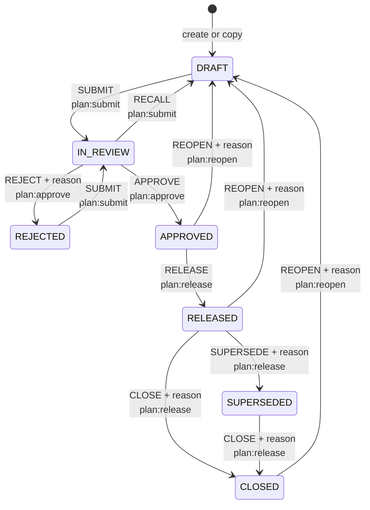
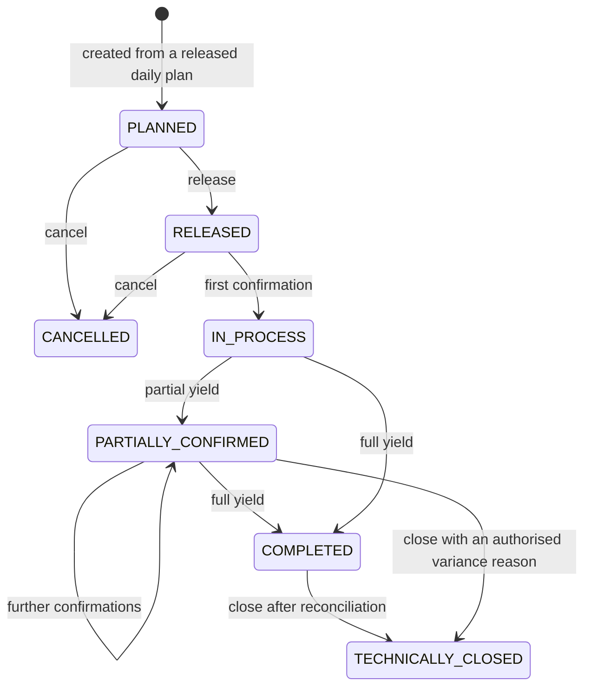
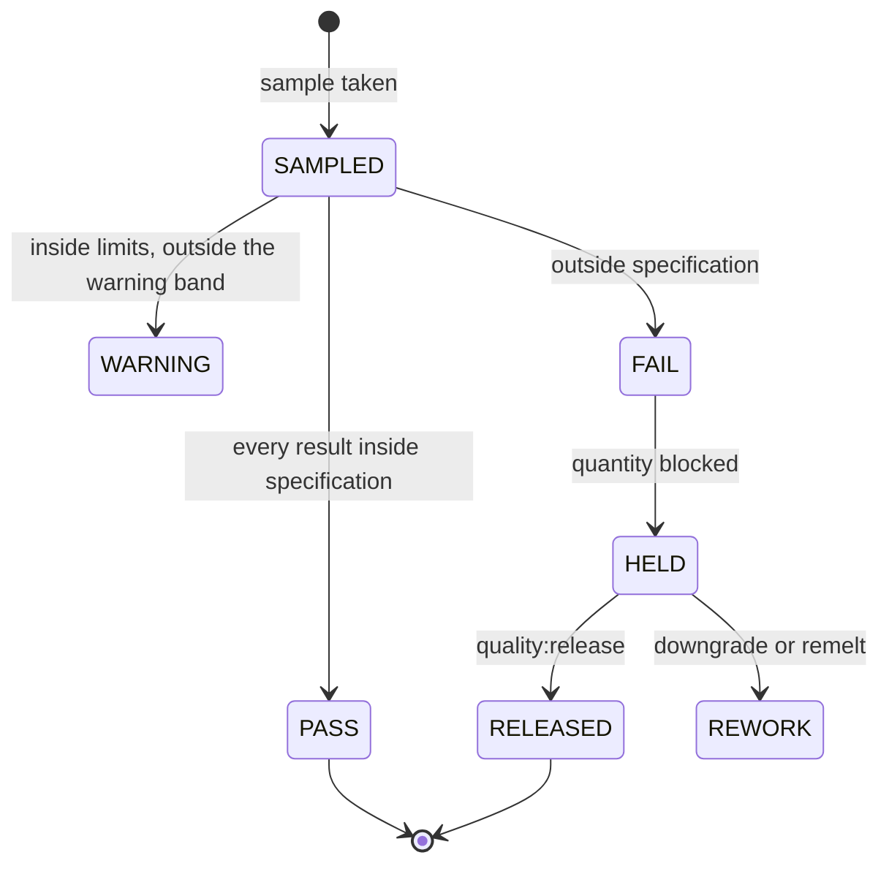

# 9. Workflow and status transition diagrams

---

## 9.1 Plan version

The state machine is a table in `backend/internal/domain/workflow.go`. Anything
not in the table is refused, and each edge names the permission that guards it.



### Rules on top of the graph

| Rule | Where |
| --- | --- |
| A `WHATIF` version has no workflow at all. Copy it into a `REVISED` version to adopt it. | `actionAllowedForType` |
| The `ACTUAL` container can only be closed or reopened. It is never approved or released. | `actionAllowedForType` |
| The submitter cannot approve their own plan. | `Planning.Transition` |
| `REJECT`, `SUPERSEDE`, `CLOSE`, `REOPEN` require a reason, stored on the audit event. | `ApplyTransition` |
| Releasing supersedes any previously released version of the season. | `Planning.Transition` |
| Reopening clears approved-by, approved-at, released-at, submitted-at and the lock date. | `Planning.Transition` |

### What each status allows

| Status | Plan rows | Assumptions and mix | Generate |
| --- | --- | --- | --- |
| `DRAFT` | editable | editable | yes |
| `REJECTED` | editable | editable | yes |
| `IN_REVIEW` | locked | locked | no |
| `APPROVED` | locked | locked | no |
| `RELEASED` | locked up to `locked_through`, editable after | locked | no |
| `SUPERSEDED`, `CLOSED` | locked | locked | no |

Actuals follow a separate rule: they may be posted to the `ACTUAL` container for
as long as the season is open, regardless of what the plan version is doing.
Closing the season stops them.

---

## 9.2 Production order (phase 4)

The tables and the enumeration exist; the service is phase 4.



An order closes only after quantity and stock reconciliation, or with an
authorised variance reason recorded against it.

---

## 9.3 Inventory posting and reversal

```mermaid
sequenceDiagram
    participant U as Operator
    participant S as Service
    participant DB as PostgreSQL
    U->>S: confirm production
    S->>DB: BEGIN
    S->>DB: insert inventory_document (RECEIPT)
    S->>DB: insert document items (signed)
    S->>DB: update stock_balances
    S->>DB: insert audit_event
    alt every step succeeded
        S->>DB: COMMIT
        S-->>U: 201 with the document number
    else any step failed
        S->>DB: ROLLBACK
        S-->>U: problem document; nothing was written
    end
```

A mistake is never edited away. A reversal document carries the same items with
the sign flipped and `reversal_of` pointing at the original, so both remain
visible in the ledger.

---

## 9.4 Quality hold (phase 4)



Held stock counts towards a store's capacity — it is physically there — but is
excluded from the available balance, so it can be neither shipped nor consumed
until released.

---

## 9.5 Alerts

Alerts are calculated, not stored as state: every dashboard request recomputes
them from the current data, so an alert cannot linger after the condition has
gone.

| Alert | Condition | Severity |
| --- | --- | --- |
| `CAPACITY_WARNING` | planned stock crosses the warning threshold | Warning |
| `CAPACITY_EXCEEDED` | planned stock reaches usable capacity | Error |
| `CRUSHING_BEHIND_SCHEDULE` | forecast completion is after the planned end | Warning; Error beyond 7 days |
| `RECOVERY_OUT_OF_RANGE` | recovery outside the configured window | Warning or Error |
| `REMELT_SUPPLY_SHORT` | refining demand exceeds planned raw sugar | Error |
| `MIX_RATE_TOO_LOW` | a mix rate cannot deliver the season tonnage | Warning |
| material shortage | requirement exceeds stock plus open orders | Error |

Alerts sort worst-first, so the top of the dashboard is the thing that needs
attention.
